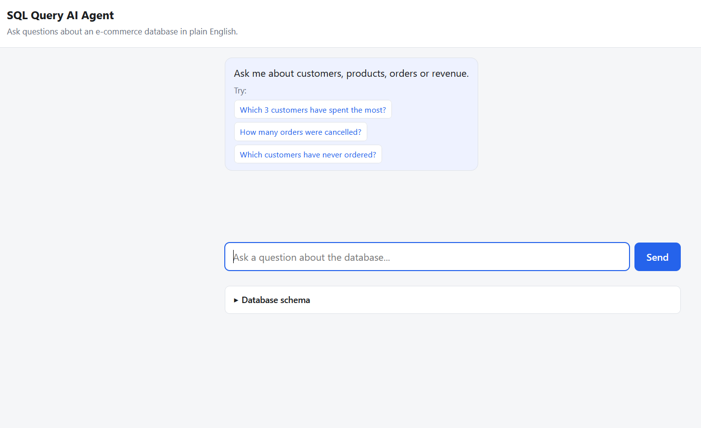
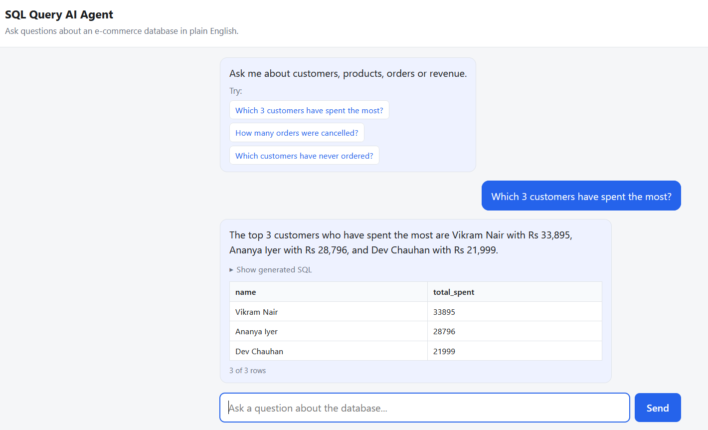
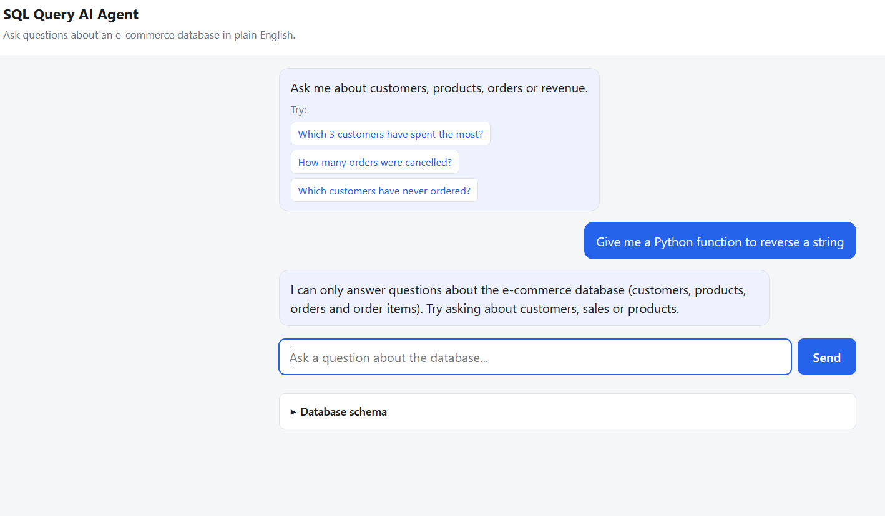
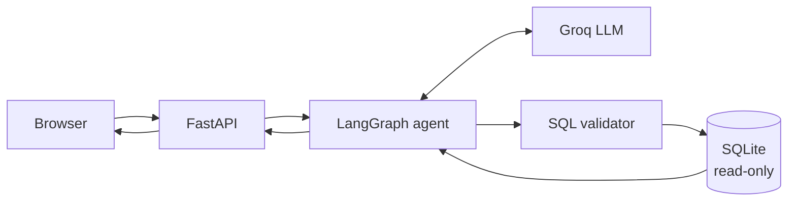

# SQL Query AI Agent

Ask questions about an e-commerce database in plain English. Get an answer, the
SQL that produced it, and the rows it returned.

**Live demo:** https://sql-query-ai-agent.onrender.com
**Video walkthrough:** https://youtu.be/bXCRQufnvPY

> **Please allow up to a minute on first load.** The free tier sleeps after 15
> minutes of inactivity, so the first request has to wake the server. Once it
> responds, everything after that is fast. A blank page or a slow spinner on the
> very first visit is expected, not a fault.

| Document | Contents |
|---|---|
| [`docs/architecture.md`](docs/architecture.md) | Components, request flow, security layers |
| [`docs/workflow.md`](docs/workflow.md) | The LangGraph state, nodes, edges and retry |
| [`PROMPTS.md`](PROMPTS.md) | Every prompt the application sends |
| [`DISCOVERIES.md`](DISCOVERIES.md) | Findings, decisions, and what went wrong |

---

## The problem

Anyone who cannot write SQL cannot query a database. Handing a language model
direct database access solves that and creates a worse problem: the model can be
persuaded to write anything, including `DROP TABLE`.

So the interesting part is not translating English to SQL. It is doing that when
the thing generating the SQL cannot be trusted.

## Features

- Natural-language questions to SQL
- Generated SQL shown in the UI, collapsible
- Results rendered as a table
- Follow-up questions using conversation history
- Out-of-scope questions politely rejected
- One automatic retry when a query fails
- Database physically cannot be written to, whatever the model produces

## Screenshots







## Architecture



One service serves both the API and the frontend. The model never touches the
database directly — everything it produces passes a validator first, and the
connection it eventually reaches is read-only and guarded by a SQLite
authorizer. Full detail in [`docs/architecture.md`](docs/architecture.md).

## Tech stack

| Layer | Choice |
|---|---|
| Backend | Python 3.12, FastAPI, Uvicorn |
| Agent | LangGraph — 5 nodes, 1 conditional edge |
| LLM | Groq `llama-3.3-70b-versatile` (free tier, no card) |
| Database | SQLite, file committed to the repo |
| Frontend | HTML, CSS, vanilla JS — no framework, no build |
| Tests | pytest, httpx |
| Hosting | Render free tier |

Total cost: nothing.

## Setup

```bash
git clone https://github.com/AviK0928/SQL_Query_AI_Agent.git
cd SQL_Query_AI_Agent

python -m venv venv
source venv/bin/activate        # Windows: venv\Scripts\activate

pip install -r requirements.txt

cp .env.example .env            # then add your Groq API key

python database/build_db.py     # optional; the .db file is already committed

uvicorn app.main:app --reload
```

Open http://localhost:8000

A free Groq API key takes about a minute at
[console.groq.com](https://console.groq.com) — email sign-up, no credit card.

## Configuration

| Variable | Required | Default |
|---|---|---|
| `GROQ_API_KEY` | Yes | — |
| `GROQ_MODEL` | No | `llama-3.3-70b-versatile` |
| `DB_PATH` | No | `database/ecommerce.db` |

`.env` is gitignored. Never commit it.

## Running the tests

```bash
python -m pytest tests/ -q
```

**79 tests, no API key needed, no network calls.** The language model is
replaced by a scripted fake, so the suite is free, offline and produces the same
result every run. Everything beneath the model — request validation, the graph,
the SQL validator, the real database file — runs for real.

Use `python -m pytest`, not bare `pytest`; the `-m` form puts the project root
on the import path.

## Using it

Ask anything answerable from four tables: customers, products, orders,
order_items.

- "Which 3 customers have spent the most?"
- "How many orders were cancelled?"
- "Which customers have never ordered?"
- Then follow up: "What about just the ones in Mumbai?"

Click **Show generated SQL** under any answer to see the query. Anything
unrelated to the database — coding questions, general knowledge, requests to
modify data — gets a polite refusal.

## API

| Method | Path | Returns |
|---|---|---|
| `GET` | `/health` | `{"status": "ok"}` |
| `GET` | `/schema` | Table and column names |
| `POST` | `/chat` | `answer`, `sql`, `columns`, `rows`, `error`, `session_id` |
| `GET` | `/` | The frontend |

`POST /chat` takes `{"question": "...", "session_id": "..."}`. The session id is
optional on the first request and returned in the response; send it back to keep
conversation context.

Failed queries return HTTP 200 with the `error` field populated, so the frontend
has one response shape to handle. Malformed requests return 422.

## Deployment

Render free web service, deployed from `main`:

- Build: `pip install -r requirements.txt`
- Start: `uvicorn app.main:app --host 0.0.0.0 --port $PORT`
- Environment: `GROQ_API_KEY` set in the Render dashboard, never in the repo

The SQLite file is committed, so there is no database to provision.

## Limitations

- Money stored as `REAL`, so large sums accumulate floating-point error
- Conversation memory is in-process and lost when the server restarts
- Free tier sleeps after 15 minutes; first request takes 30-60 seconds
- Semicolon detection is textual — a semicolon inside a string literal would be
  falsely rejected
- Prompt rules are followed most of the time, not always; anything that must
  hold is enforced in code instead
- Summaries of large result sets can overstate, since only 20 rows are sent to
  the model
- **A generated query can be valid, safe, and still answer the wrong question.**
  Nothing in the system can detect this, which is why the SQL is always shown

Each of these is explained, with the conditions under which it actually bites,
in [`DISCOVERIES.md`](DISCOVERIES.md).

## Demo video

[Watch the demo](https://youtu.be/bXCRQufnvPY?si=Av9dtlzokdHMVncn) (5 minutes)

Covers a query and its generated SQL, a follow-up question using conversation
context, both kinds of refusal, and the database protections with the test that
proves them.
