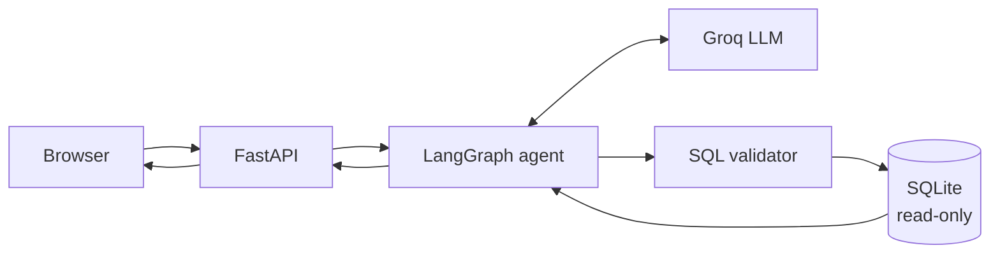

# SQL Query AI Agent

[](https://github.com/AviK0928/SQL_Query_AI_Agent/actions/workflows/ci.yml)

Ask questions about an e-commerce database in plain English. Get an answer, the
SQL that produced it, and the rows it returned.

**Live demo:** https://sql-query-agent-zxsx.onrender.com/
**Video walkthrough:** https://youtu.be/bXCRQufnvPY

> **Please allow up to a minute on first load.** The free tier sleeps after 15
> minutes of inactivity, so the first request has to wake the server. Once it
> responds, everything after that is fast. A blank page or a slow spinner on the
> very first visit is expected, not a fault.

| Document | Contents |
|---|---|
| [`docs/architecture.md`](docs/architecture.md) | Components, request flow, security layers |
| [`docs/workflow.md`](docs/workflow.md) | The LangGraph state, nodes, edges and retry |
| [`PROMPTS.md`](PROMPTS.md) | Every prompt the application sends |
| [`DISCOVERIES.md`](DISCOVERIES.md) | Findings, decisions, and what went wrong |
| [`AUDIT.md`](AUDIT.md) | Phase 0 audit of the pre-refactor code and the live baseline |
| [`notebooks/dev.ipynb`](notebooks/dev.ipynb) | Colab driver notebook: setup, quality gate, run, live eval, push |

Every design decision, limitation and security choice is recorded as a tagged
entry in [Decisions and records](#decisions-and-records) below.

---

## The problem

Anyone who cannot write SQL cannot query a database. Handing a language model
direct database access solves that and creates a worse problem: the model can be
persuaded to write anything, including `DROP TABLE`.

So the interesting part is not translating English to SQL. It is doing that when
the thing generating the SQL cannot be trusted.

## Features

- Natural-language questions to SQL
- Generated SQL shown in the UI, collapsible
- Results rendered as a table
- Follow-up questions using conversation history
- Out-of-scope questions politely rejected
- One automatic retry when a query fails
- Database physically cannot be written to, whatever the model produces

## Screenshots


## Architecture



One service serves both the API and the frontend. The model never touches the
database directly — everything it produces passes a validator first, and the
connection it eventually reaches is read-only and guarded by a SQLite
authorizer. Full detail in [`docs/architecture.md`](docs/architecture.md).

## Tech stack

| Layer | Choice |
|---|---|
| Backend | Python 3.12, FastAPI, Uvicorn |
| Agent | LangGraph — 5 nodes, 1 conditional edge |
| LLM | Groq, model set by `GROQ_MODEL` (currently `openai/gpt-oss-120b`, free tier, no card) |
| Database | SQLite, file committed to the repo |
| Frontend | HTML, CSS, vanilla JS — no framework, no build |
| Config | pydantic-settings, validated at startup |
| Tests | pytest, pytest-cov, httpx; ruff and mypy for lint and types |
| Hosting | Render free tier |

Total cost: nothing.

## Setup

Python 3.12 or 3.13.

```bash
git clone https://github.com/AviK0928/SQL_Query_AI_Agent.git
cd SQL_Query_AI_Agent

python -m venv venv
source venv/bin/activate        # Windows: venv\Scripts\activate

pip install -e ".[dev]"         # app plus test and lint tools

cp .env.example .env            # then set GROQ_API_KEY and GROQ_MODEL

python database/build_db.py     # optional; the .db file is already committed

uvicorn app.main:app --reload
```

Open http://localhost:8000

A free Groq API key takes about a minute at
[console.groq.com](https://console.groq.com) — email sign-up, no credit card.

**Google Colab:** open `notebooks/dev.ipynb` from GitHub in Colab and run the
cells in order. The notebook header lists which cells to rerun after a VM
recycle (P7).

## Configuration

All settings are read once at startup by `app/config.py` (D14). Missing or
invalid values stop the app with an error that names the variable and never
prints its value (S3). Environment variables override `.env`.

| Variable | Required | Default | Notes |
|---|---|---|---|
| `GROQ_API_KEY` | Yes | — | Never logged or echoed |
| `GROQ_MODEL` | Yes | — | No default on purpose (D14); check the Groq catalog |
| `DB_PATH` | No | `database/ecommerce.db` | Relative paths resolve against the repo root |
| `MAX_ROWS` | No | `200` | Row cap per query |
| `QUERY_TIMEOUT_S` | No | `5.0` | SQLite query timeout |
| `MAX_HISTORY_TURNS` | No | `3` | Conversation turns replayed to the model |

`.env` is gitignored. Never commit it.

## Running the tests

```bash
pytest -q
```

**106 tests (T2), no API key needed, no network calls.** The language model is
replaced by a scripted fake. The suite is offline by construction, not by
convention: a guard in `tests/conftest.py` removes every setting from the
environment and blocks and records any non-loopback network attempt, failing
the test even if the app swallowed the error (T1). Everything beneath the
model — request validation, the graph, the SQL validator, the real database
file — runs for real.

The full quality gate, the same checks CI runs:

```bash
ruff check . && ruff format --check . && mypy app && pytest -q --cov
```

Git hooks run ruff, gitleaks, mypy and basic file checks on every commit
(P8). Install them once per clone with `pre-commit install`.

CI (`.github/workflows/ci.yml`) runs the same gate on every pull request and
push to `main`, on Python 3.12 and 3.13, plus bandit, pip-audit and gitleaks
(D17). A pull request cannot merge into `main` unless all four checks pass (P10).

## Using it

Ask anything answerable from four tables: customers, products, orders,
order_items.

- "Which 3 customers have spent the most?"
- "How many orders were cancelled?"
- "Which customers have never ordered?"
- Then follow up: "What about just the ones in Mumbai?"

Click **Show generated SQL** under any answer to see the query. Anything
unrelated to the database — coding questions, general knowledge, requests to
modify data — gets a polite refusal.

## API

| Method | Path | Returns |
|---|---|---|
| `GET` | `/health` | `{"status": "ok"}` |
| `GET` | `/schema` | Table and column names |
| `POST` | `/chat` | `answer`, `sql`, `columns`, `rows`, `truncated`, `error`, `out_of_scope`, `session_id` |
| `GET` | `/` | The frontend |

`POST /chat` takes `{"question": "...", "session_id": "..."}`. The session id is
optional on the first request and returned in the response; send it back to keep
conversation context.

Failed queries return HTTP 200 with the `error` field populated, so the frontend
has one response shape to handle. Malformed requests return 422.

## Deployment

Render free web service, deployed from `main`:

- Build: `pip install -r requirements.txt` (the file delegates to `pyproject.toml`, D12)
- Start: `uvicorn app.main:app --host 0.0.0.0 --port $PORT`
- Environment: `GROQ_API_KEY` and `GROQ_MODEL` set in the Render dashboard, never in the repo

The SQLite file is committed, so there is no database to provision.

## Limitations

- Money stored as `REAL`, so large sums accumulate floating-point error
- Conversation memory is in-process and lost when the server restarts
- Free tier sleeps after 15 minutes; first request takes 30-60 seconds
- Semicolon detection is textual — a semicolon inside a string literal would be
  falsely rejected
- Prompt rules are followed most of the time, not always; anything that must
  hold is enforced in code instead
- Summaries of large result sets can overstate, since only 20 rows are sent to
  the model
- **A generated query can be valid, safe, and still answer the wrong question.**
  Nothing in the system can detect this, which is why the SQL is always shown
- **Update (3 Sep 2026)** — Groq decommissioned `llama-3.3-70b-versatile`
  on 16 Aug 2026. Migrated to `openai/gpt-oss-120b` via the `GROQ_MODEL`
  environment variable on the host. The regression query (top 3 customers by
  revenue) returned identical figures under the new model, and the
  `unit_price` / cancelled-order rules in the prompt held. The code default was
  left stale at the time (A-01 in `AUDIT.md`); since Phase 1 there is no code
  default at all (D14).
- Groq free-tier quotas cap throughput; tokens per minute, not requests, is
  the binding limit (L4)

Each of these is explained, with the conditions under which it actually bites,
in [`DISCOVERIES.md`](DISCOVERIES.md).

## Decisions and records

Tags: `D` decision, `L` limitation, `S` security, `T` testing, `H` data
handling, `P` process, `V` verification. New entries continue each series.
Entries are never renumbered; superseded entries stay, marked as such.

Tags cited in code or docs before the Phase 1 refactor were reconstructed from
where they are cited. Numbers that were never cited anywhere cannot be
recovered and are listed as such rather than invented.

### Decisions

| Tag | Decision | Where |
|---|---|---|
| D1 | Revenue and order totals use `order_items.unit_price * quantity` (the price actually paid), not `products.price`. | `app/prompts.py`, `tests/test_prompts.py` |
| D2 | The prompt is not a security boundary. Prompt rules reduce retries and cost; every guarantee is enforced in code (S1, S2). | `app/prompts.py` |
| D3–D10 | Not recoverable (pre-refactor, never cited). | — |
| D11 | *Superseded by D15.* Liveness (`/health`) must not depend on the LLM provider; tested by running `/health` with no API key. | — |
| D12 | `pyproject.toml` is the single source of dependencies. `requirements.txt` contains only `-e .` so Render's build command did not change; editable so `app/` resolves `database/` and `frontend/` from the repo. | `pyproject.toml`, `requirements.txt` |
| D13 | Every direct dependency is pinned exactly, from a clean-venv `pip freeze` (24 Sep 2026). Transitive packages are observed, not pinned: `langchain-core 1.6.4`, `groq 0.37.1`, `pydantic 2.13.5`. | `pyproject.toml` |
| D14 | All configuration goes through typed `Settings`. `GROQ_MODEL` has no default, so a decommissioned model cannot survive as a silent fallback (A-01). Startup is refused on missing or invalid settings. | `app/config.py` |
| D15 | Supersedes D11. The app no longer starts without a key, so "no key" is not a runnable state. D11's intent is tested directly: `/health` returns 200 with zero LLM calls and zero database calls. | `tests/test_api.py::test_health_never_touches_the_llm_or_db` |
| D16 | Dependencies are injected: `create_app(settings, llm=None)` builds `Agent`, `Database` and `SessionStore`. No module-level clients, graphs or session dicts. `app.main.app` is built lazily on first access so `uvicorn app.main:app` keeps working without a start-command change. | `app/main.py`, `app/agent.py`, `app/db.py` |
| D17 | CI on every PR and push to `main`: lint and types first (fail fast), then tests on Python 3.12 and 3.13 and security scans in parallel. Read-only token permissions, no secrets, never calls Groq. Actions are pinned to major tags and kept current by Dependabot, which also proposes weekly pip updates, each gated by CI. The repo is public, so Actions minutes are free. | `.github/workflows/ci.yml`, `.github/dependabot.yml` |

### Limitations

| Tag | Limitation | Where |
|---|---|---|
| L1–L2 | Not recoverable (pre-refactor, never cited). | — |
| L3 | Conversation sessions are process-local and lost on restart. Acceptable on a single free-tier instance. Access is now lock-guarded (D16). | `app/main.py::SessionStore` |
| L4 | Groq free-tier limits for `openai/gpt-oss-120b`, read 24 Sep 2026: 30 RPM, 1K RPD, 8K TPM, 200K TPD. Measured ~590 tokens per call, so TPM is the binding limit (~10 calls/min with a 20% margin). Re-check in the Groq console; limits change. | `AUDIT.md` §5 |

### Security

| Tag | Control | Where |
|---|---|---|
| S1 | SQL validator: the first, cheap gate. Currently regex-based with known false rejections and a comment-stripping bug (A-03); replaced by sqlglot AST validation in Phase 3. | `app/validator.py` |
| S2 | The enforcement layer: SQLite opened read-only (`mode=ro`) with an authorizer that denies everything except SELECT/READ/FUNCTION/RECURSIVE, plus a query timeout. | `app/db.py` |
| S3 | `ConfigError` never contains input values. pydantic's own `ValidationError` embeds `input_value`, which can include the API key, so it is replaced and suppressed (`from None`). | `app/config.py`, `tests/test_config.py` |
| S4 | bandit scans `app/` in CI. Its four findings at introduction were false positives, all in `app/prompts.py`, suppressed line by line with `# nosec <code>` and a reason: B105 on the `OUT_OF_SCOPE`/`READ_ONLY` refusal markers (not credentials) and B608 on the two system prompts (text for the LLM, never executed as SQL). bandit prints "nosec encountered … but no failed test" warnings for lines inside those multi-line strings; they do not fail the scan and disappear in Phase 7, when prompts move to versioned files. | `app/prompts.py`, `pyproject.toml` |
| S5 | Dependency and secret scanning in CI. pip-audit checks every installed package against known advisories; its first run found PYSEC-2026-1845 in `pytest 8.4.2`, fixed by upgrading the pin to `9.0.3` (same 106 tests collected and passing). gitleaks scans the full commit history on every run; the first run over all history was clean (24 Sep 2026). | `.github/workflows/ci.yml`, `pyproject.toml` |

### Testing

| Tag | Record | Where |
|---|---|---|
| T1 | The default test run is offline by construction. An autouse guard removes every setting from the environment and blocks and records non-loopback DNS and connections; any recorded attempt fails the test at teardown, even if the app swallowed the error (A-04). | `tests/conftest.py`, `tests/test_offline_guard.py` |
| T2 | 106 tests collected and passing (`pytest --collect-only`), 24 Sep 2026: first at `e79f31c`, re-confirmed after the Phase 1 lint and format pass. Up from 79 at `f6e44c0`. | `tests/` |
| T3 | The Phase 1 lint and format pass did not change any test. Proven by comparing the syntax tree of all 146 `assert` statements before and after `ruff format` and `ruff check --fix`, and the full syntax tree of each hand-edited file (identical). | Phase 1 notebook cells P1-13, P1-15 |
| T4 | CI fails if fewer than `MIN_TESTS` (106) tests are collected, so tests cannot disappear silently. Raising the number is a deliberate edit in `ci.yml`. The suite runs on Python 3.12 (Render) and 3.13 (Colab). | `.github/workflows/ci.yml` |

### Data handling

None recorded yet (Phase 9).

### Process

| Tag | Record | Where |
|---|---|---|
| P1–P5 | Not recoverable (pre-refactor, never cited). | — |
| P6 | The `frontend/` static mount is conditional, because git does not track empty directories and the folder was absent from fresh clones before the frontend existed. | `app/main.py` |
| P7 | Development runs in Google Colab inside a project venv at `/content/venv`, isolated from Colab's preinstalled packages (A-23). Colab's Python lacks `ensurepip`, so the notebook falls back to `virtualenv`. A VM-recycle recovery run from an empty `/content` was completed on 24 Sep 2026. | `notebooks/dev.ipynb` |
| P8 | Git hooks via pre-commit: file hygiene checks (`pre-commit-hooks v6.0.0`), ruff lint and format (`v0.16.8`, equal to the `pyproject.toml` pin), gitleaks secret scanning (`v8.30.0`), and mypy from the project environment. Revs pinned with `pre-commit autoupdate --repo`, 24 Sep 2026. Markdown is excluded from ruff so docs keep their author's formatting. | `.pre-commit-config.yaml`, `pyproject.toml` |
| P9 | Three times a pull request was merged without its last intended commit: PR #2 (merge commit, stale head; two verified commits missing; fixed by #3), PR #4 (squash, merged before the docs commit landed; registry update missing; fixed by #13), and PR #14 (squash of a branch whose final commit, this row's correction, was never pushed; the merge commit `bc49311` is empty; fixed in the Phase 3 carry-over PR). All three were caught by comparing `main`'s tree with the last verified commit, not by commit ancestry (which squash merges break). `main` keeps the resulting history rather than being force-pushed. Rule since: before merging, the push cell must have succeeded and the PR's Commits tab must end at the hash it printed. | Notebook cells P1-17, P1-18, P2-8, P3-2 |
| P10 | `main` is protected: changes arrive only through pull requests, which merge only when all four CI checks pass. The repo allows squash merging only, with the PR title as the commit message, so each PR lands as one conventional commit (prevents P9). Force pushes and deletion of `main` are blocked. Pushing workflow files needs a PAT with **Workflows: Read and write** on this repository. | GitHub repository settings |
| P11 | Dependabot PR #8 (uvicorn 0.51.0 → 0.53.0) was merged as an empty squash commit (`ec8a5c2`): its change was lost resolving a conflict on the PR branch, so the history said uvicorn was bumped while `pyproject.toml` still pinned 0.51.0. Found in the Phase 2 close-out and restored in Phase 3. Dependabot now groups updates per ecosystem, so sibling PRs no longer conflict on the same `pyproject.toml` lines. Rule since: after merging any PR, `git show --stat` of the merge commit must list the expected files. | `.github/dependabot.yml`, `pyproject.toml` |

### Verification

None recorded yet (Phase 10).

## Demo video

[Watch the demo](https://youtu.be/bXCRQufnvPY?si=Av9dtlzokdHMVncn) (5 minutes)

Covers a query and its generated SQL, a follow-up question using conversation
context, both kinds of refusal, and the database protections with the test that
proves them.
