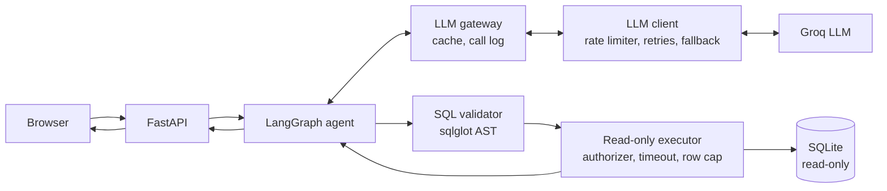

# SQL Query AI Agent

[](https://github.com/AviK0928/SQL_Query_AI_Agent/actions/workflows/ci.yml)

Ask questions about an e-commerce database in plain English. Get an answer, the
SQL that produced it, and the rows it returned.

**Live demo:** https://sql-query-agent-zxsx.onrender.com/
**Video walkthrough:** https://youtu.be/bXCRQufnvPY

> **Please allow up to a minute on first load.** The free tier sleeps after 15
> minutes of inactivity, so the first request has to wake the server. Once it
> responds, everything after that is fast. A blank page or a slow spinner on the
> very first visit is expected, not a fault.

| Document | Contents |
|---|---|
| [`docs/architecture.md`](docs/architecture.md) | Components, request flow, security layers |
| [`docs/workflow.md`](docs/workflow.md) | The LangGraph state, nodes, edges and retry |
| [`PROMPTS.md`](PROMPTS.md) | Every prompt the application sends |
| [`DISCOVERIES.md`](DISCOVERIES.md) | Findings, decisions, and what went wrong |
| [`AUDIT.md`](AUDIT.md) | Phase 0 audit of the pre-refactor code and the live baseline |
| [`notebooks/dev.ipynb`](notebooks/dev.ipynb) | Colab driver notebook: setup, quality gate, run, live eval, push |

Every design decision, limitation and security choice is recorded as a tagged
entry in [Decisions and records](#decisions-and-records) below.

---

## The problem

Anyone who cannot write SQL cannot query a database. Handing a language model
direct database access solves that and creates a worse problem: the model can be
persuaded to write anything, including `DROP TABLE`.

So the interesting part is not translating English to SQL. It is doing that when
the thing generating the SQL cannot be trusted.

## Features

- Natural-language questions to SQL
- Generated SQL shown in the UI, collapsible
- Results rendered as a table
- Follow-up questions using conversation history
- Out-of-scope questions politely rejected
- One automatic retry when a query fails
- Database physically cannot be written to, whatever the model produces

## Screenshots


## Architecture



One service serves both the API and the frontend. The model never touches the
database directly — everything it produces is parsed and checked by a sqlglot validator (S1),
and only a validated query reaches the executor, whose connection is read-only
and guarded by a SQLite authorizer (S2). Full detail in [`docs/architecture.md`](docs/architecture.md).

## Tech stack

| Layer | Choice |
|---|---|
| Backend | Python 3.12, FastAPI, Uvicorn |
| Agent | LangGraph — 5 nodes, 1 conditional edge |
| LLM | Groq, model set by `GROQ_MODEL` (currently `openai/gpt-oss-120b`, free tier, no card) |
| Database | SQLite, file committed to the repo |
| Frontend | HTML, CSS, vanilla JS — no framework, no build |
| Config | pydantic-settings, validated at startup |
| Tests | pytest, pytest-cov, httpx; ruff and mypy for lint and types |
| Hosting | Render free tier |

Total cost: nothing.

## Setup

Python 3.12 or 3.13.

```bash
git clone https://github.com/AviK0928/SQL_Query_AI_Agent.git
cd SQL_Query_AI_Agent

python -m venv venv
source venv/bin/activate        # Windows: venv\Scripts\activate

pip install -e ".[dev]"         # app plus test and lint tools

cp .env.example .env            # then set GROQ_API_KEY and GROQ_MODEL

python database/build_db.py     # optional; the .db file is already committed

uvicorn app.main:app --reload
```

Open http://localhost:8000

A free Groq API key takes about a minute at
[console.groq.com](https://console.groq.com) — email sign-up, no credit card.

**Google Colab:** open `notebooks/dev.ipynb` from GitHub in Colab and run the
cells in order. The notebook header lists which cells to rerun after a VM
recycle (P7).

## Configuration

All settings are read once at startup by `app/config.py` (D14). Missing or
invalid values stop the app with an error that names the variable and never
prints its value (S3). Environment variables override `.env`.

| Variable | Required | Default | Notes |
|---|---|---|---|
| `GROQ_API_KEY` | Yes | — | Never logged or echoed |
| `GROQ_MODEL` | Yes | — | No default on purpose (D14); check the Groq catalog |
| `DB_PATH` | No | `database/ecommerce.db` | Relative paths resolve against the repo root |
| `MAX_ROWS` | No | `200` | Row cap per query |
| `QUERY_TIMEOUT_S` | No | `5.0` | SQLite query timeout |
| `MAX_HISTORY_TURNS` | No | `3` | Conversation turns replayed to the model |
| `MAX_REPAIR_ATTEMPTS` | No | `1` | Repairs of a failed query (0–3); each costs one model call |
| `LLM_LIMITS` | Yes | — | Per-model limits from the Groq console, as JSON: `{"model": {"rpm": …, "rpd": …, "tpm": …, "tpd": …}}`. Every model the app can call needs an entry; never hard-coded (D22) |
| `GROQ_FALLBACK_MODEL` | No | none | Used on persistent 429s or a retired model; must differ from `GROQ_MODEL` |
| `LLM_ROLE_MODELS` | No | `{}` | Per-role overrides as JSON; roles: `classifier`, `sql_generator`, `sql_repair`, `synthesizer`, `judge` |
| `LLM_SAFETY_MARGIN` | No | `0.8` | Share of each limit the client may use |
| `LLM_MAX_WAIT_S` | No | `20` | Longest a request waits for rate-limit capacity before failing fast |
| `LLM_TIMEOUT_S` | No | `30` | Per HTTP call to Groq |
| `LLM_MAX_ATTEMPTS` | No | `3` | Per model, including the first try |
| `LLM_CACHE_PATH` | No | off | Response cache file; set in dev and evals, not in production |
| `LLM_LOG_CONTENT` | No | `false` | Log prompts and responses; keep off in production |
| `LLM_LOG_PATH` | No | stdout | JSONL file for the LLM call log |

`.env` is gitignored. Never commit it.

## Running the tests

```bash
pytest -q
```

**414 tests (T10), no API key needed, no network calls.** The language model is
replaced by a scripted fake. The suite is offline by construction, not by
convention: a guard in `tests/conftest.py` removes every setting from the
environment and blocks and records any non-loopback network attempt, failing
the test even if the app swallowed the error (T1). Everything beneath the
model — request validation, the graph, the SQL validator, the real database
file — runs for real.

The SQL safety layer is also covered by hypothesis property tests (T6) and a
manual mutation-testing run with mutmut (T7): `mutmut run "app.sql.validator*"
"app.sql.executor*"`, configured in `pyproject.toml`.

The full quality gate, the same checks CI runs:

```bash
ruff check . && ruff format --check . && mypy app && pytest -q --cov
```

Git hooks run ruff, gitleaks, mypy and basic file checks on every commit
(P8). Install them once per clone with `pre-commit install`.

CI (`.github/workflows/ci.yml`) runs the same gate on every pull request and
push to `main`, on Python 3.12 and 3.13, plus bandit, pip-audit and gitleaks
(D17). A pull request cannot merge into `main` unless all four checks pass (P10).

## Using it

Ask anything answerable from four tables: customers, products, orders,
order_items.

- "Which 3 customers have spent the most?"
- "How many orders were cancelled?"
- "Which customers have never ordered?"
- Then follow up: "What about just the ones in Mumbai?"

Click **Show generated SQL** under any answer to see the query. Anything
unrelated to the database — coding questions, general knowledge, requests to
modify data — gets a polite refusal.

## API

| Method | Path | Returns |
|---|---|---|
| `GET` | `/health` | `{"status": "ok"}` |
| `GET` | `/schema` | Table and column names |
| `POST` | `/chat` | `answer`, `sql`, `columns`, `rows`, `truncated`, `limit_reached`, `error`, `out_of_scope`, `session_id`, `request_id`, `needs_clarification` |
| `GET` | `/` | The frontend |

`POST /chat` takes `{"question": "...", "session_id": "..."}`. The session id is
optional on the first request and returned in the response; send it back to keep
conversation context.

Failed queries return HTTP 200 with `error` set to an error code such as
`EXECUTION_ERROR` or `FORBIDDEN_WRITE` (`app/sql/errors.py`), or an `LLM_*` code
such as `LLM_RATE_LIMITED` (`app/llm/client.py`), never database or provider
text (H1), so the frontend has one response shape to handle. `request_id` ties a
response to its LLM call-log lines (H3). Rejected input returns `INPUT_EMPTY`,
`INPUT_TOO_LONG` or `INPUT_NO_TEXT` without a model call, and `needs_clarification`
marks an answer that is a clarifying question (D27, D28). Malformed requests return 422.

## Deployment

Render free web service, deployed from `main`:

- Build: `pip install -r requirements.txt` (the file delegates to `pyproject.toml`, D12)
- Start: `uvicorn app.main:app --host 0.0.0.0 --port $PORT`
- Environment: `GROQ_API_KEY` and `GROQ_MODEL` set in the Render dashboard, never in the repo

The SQLite file is committed, so there is no database to provision.

## Limitations

- Money stored as `REAL`, so large sums accumulate floating-point error
- Conversation memory is in-process and lost when the server restarts
- Free tier sleeps after 15 minutes; first request takes 30-60 seconds
- A query's own `LIMIT` below the row cap is kept (the prompt still asks for
  `LIMIT 100`); when it is hit exactly the response sets `limit_reached` and the
  answer is told more rows may exist (L5)
- Prompt rules are followed most of the time, not always; anything that must
  hold is enforced in code instead
- Summaries of large result sets can overstate, since only 20 rows are sent to
  the model
- **A generated query can be valid, safe, and still answer the wrong question.**
  Nothing in the system can detect this, which is why the SQL is always shown
- **Update (3 Sep 2026)** — Groq decommissioned `llama-3.3-70b-versatile`
  on 16 Aug 2026. Migrated to `openai/gpt-oss-120b` via the `GROQ_MODEL`
  environment variable on the host. The regression query (top 3 customers by
  revenue) returned identical figures under the new model, and the
  `unit_price` / cancelled-order rules in the prompt held. The code default was
  left stale at the time (A-01 in `AUDIT.md`); since Phase 1 there is no code
  default at all (D14).
- Groq free-tier quotas cap throughput; tokens per minute, not requests, is
  the binding limit (L4)
- Rate-limit daily counters live in memory and reset on restart; Groq's own
  headers re-sync the request count on the next call (L7)

Each of these is explained, with the conditions under which it actually bites,
in [`DISCOVERIES.md`](DISCOVERIES.md).

## Decisions and records

Tags: `D` decision, `L` limitation, `S` security, `T` testing, `H` data
handling, `P` process, `V` verification. New entries continue each series.
Entries are never renumbered; superseded entries stay, marked as such.

Tags cited in code or docs before the Phase 1 refactor were reconstructed from
where they are cited. Numbers that were never cited anywhere cannot be
recovered and are listed as such rather than invented.

### Decisions

| Tag | Decision | Where |
|---|---|---|
| D1 | Revenue and order totals use `order_items.unit_price * quantity` (the price actually paid), not `products.price`. | `app/prompts.py`, `tests/test_prompts.py` |
| D2 | The prompt is not a security boundary. Prompt rules reduce retries and cost; every guarantee is enforced in code (S1, S2). | `app/prompts.py` |
| D3–D10 | Not recoverable (pre-refactor, never cited). | — |
| D11 | *Superseded by D15.* Liveness (`/health`) must not depend on the LLM provider; tested by running `/health` with no API key. | — |
| D12 | `pyproject.toml` is the single source of dependencies. `requirements.txt` contains only `-e .` so Render's build command did not change; editable so `app/` resolves `database/` and `frontend/` from the repo. | `pyproject.toml`, `requirements.txt` |
| D13 | Every direct dependency is pinned exactly, from a clean-venv `pip freeze` (24 Sep 2026). Transitive packages are observed, not pinned: `langchain-core 1.6.4`, `groq 0.37.1`, `pydantic 2.13.5`. | `pyproject.toml` |
| D14 | All configuration goes through typed `Settings`. `GROQ_MODEL` has no default, so a decommissioned model cannot survive as a silent fallback (A-01). Startup is refused on missing or invalid settings. | `app/config.py` |
| D15 | Supersedes D11. The app no longer starts without a key, so "no key" is not a runnable state. D11's intent is tested directly: `/health` returns 200 with zero LLM calls and zero database calls. | `tests/test_api.py::test_health_never_touches_the_llm_or_db` |
| D16 | Dependencies are injected: `create_app(settings, llm=None)` builds `Agent`, `Database` and `SessionStore`. No module-level clients, graphs or session dicts. `app.main.app` is built lazily on first access so `uvicorn app.main:app` keeps working without a start-command change. | `app/main.py`, `app/agent.py`, `app/db.py` |
| D17 | CI on every PR and push to `main`: lint and types first (fail fast), then tests on Python 3.12 and 3.13 and security scans in parallel. Read-only token permissions, no secrets, never calls Groq. Actions are pinned to major tags and kept current by Dependabot, which also proposes weekly pip updates, each gated by CI. The repo is public, so Actions minutes are free. | `.github/workflows/ci.yml`, `.github/dependabot.yml` |
| D18 | SQL is validated by parsing it with sqlglot (SQLite dialect), replacing the regex validator (A-03). Checks run specific to general: size; first-token classification (writes and PRAGMA/ATTACH/VACUUM/EXPLAIN… identified by token, so their codes are stable across sqlglot versions); exactly one statement; no write node anywhere in the tree; the root must be a SELECT or set operation; no forbidden functions (`load_extension`, `pragma_*`, table-valued functions in FROM); every table in an allowlist read from `sqlite_master` (CTE names exempt, schemas other than `main` rejected). The SQL that runs is regenerated from the checked tree (comments removed) and must itself re-parse. | `app/sql/validator.py` |
| D19 | The row cap is owned by code. The outermost `LIMIT` becomes `cap + 1` when absent or at/above the cap, and the executor fetches `cap + 1` rows, so `truncated` is exact (fixes A-02 for the cap). A query `LIMIT` below the cap is kept and reported as `query_limit`; when hit exactly, `limit_reached` is set and the answer prompt says more rows may exist. The answer prompt's notes (rows hidden beyond 20, truncated, limit reached) are added independently. | `app/sql/validator.py`, `app/sql/executor.py`, `app/prompts.py` |
| D20 | Typed error taxonomy: 13 `SqlErrorCode`s raised as `SqlSafetyError(code, detail)`. Only `PARSE_ERROR`, `UNKNOWN_TABLE`, `EXECUTION_ERROR` and `INVALID_LIMIT` earn the single retry; a forbidden write, stacked statement, timeout or other final code does not, saving a Groq request. Users get a fixed message per code; `detail` goes only to the retry prompt and logs, and the constructor rejects an empty one (found by mutation testing, T7). | `app/sql/errors.py`, `app/agent.py` |
| D21 | API response (Phase 3): `sql` is the SQL that passed validation and ran, or `null` when nothing passed, so rejected SQL is never shown as the query that ran; `error` is an `SqlErrorCode` value; new field `limit_reached`. The frontend uses `error` only as a flag, so the UI is unchanged. | `app/agent.py`, `app/main.py` |
| D22 | LLM configuration is typed and explicit. Per-model Groq limits come from `LLM_LIMITS` (JSON copied from the console), and startup is refused if any model the app can call (`GROQ_MODEL`, `GROQ_FALLBACK_MODEL`, `LLM_ROLE_MODELS`) lacks an entry, so no limit is hard-coded or remembered. Models are resolved per role through `ModelRegistry`; every role uses `GROQ_MODEL` until Phase 6 assigns them with evals. The fallback is optional and must differ from the primary. `Database.schema_hash()` fingerprints the schema definition (not the data) for reproducibility records. Deployments must set `LLM_LIMITS` before this code runs. | `app/config.py`, `app/llm/registry.py`, `app/db.py` |
| D23 | Model calls go through one stack built from `Settings`: the Groq SDK transport (SDK retries off) → `LlmClient` (per-model rate limiter; tenacity retries on 429, 5xx and timeouts, honouring `retry-after` up to `LLM_MAX_WAIT_S`; fallback to `GROQ_FALLBACK_MODEL` on a persistent 429 or a retired model) → `LlmGateway` (cache when `LLM_CACHE_PATH` is set, call log, usage). Nodes call by role (`sql_generator`, `sql_repair`, `synthesizer`) with a request id per question. A failure during generation or repair returns a fixed answer with an `LLM_*` code and no SQL; a failure during the summary keeps the rows. The API gains `request_id`; `internal_error` remains only for unexpected faults, so the A-04 guard test now expects `LLM_UNAVAILABLE`. `langchain-groq` was removed. | `app/llm/`, `app/agent.py`, `app/main.py` |
| D24 | Each prompt has an id derived from its text (`name@` + 8 hex characters of a SHA-256), sent with every model call: any edit changes the id, which invalidates cached answers and shows in every call-log line which prompt text was used. Phase 7 replaces this with versioned prompt files. At Phase 4: `sql_gen@27e9e81d`, `sql_repair@a5c30252`, `answer@3c3a3566`. | `app/prompts.py`, `tests/unit/test_prompt_ids.py` |
| D25 | `groq==0.37.1` and `tenacity==9.1.4` are direct, exact pins (D13), because the client imports them. tenacity's typed `stop_any` accepts only `stop_base` instances, so the "retry-after longer than the maximum wait" stop is a small `stop_base` subclass; strict mypy caught this, while every test passed. | `pyproject.toml`, `app/llm/client.py` |
| D26 | The agent is a package (`app/agent/`): `graph.py` wires LangGraph, `state.py` types the state, and each node's decision is a pure function in `app/agent/nodes/` (guard, classify, check), testable without a model, database or graph. Flow: `guard_input → generate_sql → classify_intent → validate → execute → (repair) → format_answer → check_answer`. Deviation from the planned order, on purpose: classification reads the generator's reply instead of making its own model call, so one call does both and the two can never disagree. `load_relevant_schema` is deferred: with four tables, table selection saves few tokens and risks dropping a needed table; it is added when the schema grows. | `app/agent/` |
| D27 | Ambiguous questions get a clarifying question: the SQL prompt tells the model to reply `CLARIFY: <question>` when an answer needs a choice the user has not made (for example what "best" is measured by). The response sets `needs_clarification`, and the exchange is kept in the session history so the user's follow-up has its context. Measured before keeping it (PROMPTS.md). | `app/prompts.py`, `app/agent/nodes/classify.py`, `app/main.py` |
| D28 | `guard_input` rejects empty, over-500-character and letterless questions with `INPUT_EMPTY`, `INPUT_TOO_LONG` or `INPUT_NO_TEXT` before any model call, so they cost no Groq request. | `app/agent/nodes/guard.py` |
| D29 | `check_answer` makes honest disclosure guaranteed rather than requested: when a result is empty, capped or limited and the answer does not say so, a fixed sentence is appended. Numbers in the answer that cannot be traced to the rows, the row count or the question are recorded as `UNSUPPORTED_NUMBERS` in `answer_checks` but not rewritten, since derived figures would cause false alarms. Text is compared after NFKC normalisation with Indian digit grouping handled. No model call. | `app/agent/nodes/check.py` |
| D30 | `MAX_REPAIR_ATTEMPTS` (0–3, default 1: the previous behaviour) sets how many times a repairable error is sent back to the model. Each repair increments `retry_count`, and routing stops at the setting, so the loop is bounded by construction. Raising it costs one call per extra repair; Phase 6 decides with evidence. | `app/config.py`, `app/agent/graph.py` |
| D31 | Models are selected per role by a framework fixed before any selection run: gates (availability and production status, context window, ≥90% format compliance, no prompt leak), then weighted scores against fixed targets, reported with bootstrap intervals; near-ties go to correctness, then efficiency. Priorities agreed: correctness, refusal and clarity, injection resistance, column minimisation, reliability, efficiency. | `MODEL_SELECTION.md` |
| D32 | Live evals can be run from GitHub Actions (manual `workflow_dispatch`, a small subset, the Groq key as a repo secret, the report uploaded as an artifact). Built in Phase 6 rather than Phase 10, so a live run can be triggered and its evidence downloaded from the GitHub UI. Never runs on push. | `.github/workflows/eval.yml` (Phase 6) |
| D33 | Eval items grade correctness, not representation. An item may list `alt_reference_sql` alternates that differ from its reference only in representation (a month label, a fraction instead of a percentage); `tests/unit/test_golden_v2.py` pins every alternate to the reference's column and row counts, and pins which items have alternates (g13, g19). An ambiguous item is rewritten (g39), never given alternates with different answers. `golden_v1` is unchanged because earlier reports cite its hash. Details in EVALS.md. |
| D34 | Generator shortlist from the smoke screen (26 Sep 2026; 15 items chosen by a fixed rule, one per tier): `qwen/qwen3.8-27b` and `openai/gpt-oss-120b` go to full runs. `allam-2-7b` was dropped: it missed a T1 filter, generated a `DELETE` (blocked by the validator), and false-refused a clear question. `gpt-oss-20b` was dropped as a generator candidate (it failed a T3 join and had the lowest hard-tier score) but stays the fallback model, a role chosen for availability. Smoke results only drop models (L10). |
| D35 | Live tests (`tests/live/`, `pytest -m live`) are deselected by default (`addopts -m 'not live'`), so `pytest` and CI stay offline. The folder overrides the offline guard, fails any test missing the `live` marker, and fails rather than skips when configuration is missing, because a skipped live test is green while checking nothing. They run with the response cache and the fallback off, so every answer is a fresh call to the configured model. |
| D36 | Long eval runs execute as a detached background process in Colab (log file, exit code at its end, a read-only status cell), one at a time, so the notebook stays usable. While a run is active, commits stage explicit paths only, never `evals/reports/`. |

### Limitations

| Tag | Limitation | Where |
|---|---|---|
| L1–L2 | Not recoverable (pre-refactor, never cited). | — |
| L3 | Conversation sessions are process-local and lost on restart. Acceptable on a single free-tier instance. Access is now lock-guarded (D16). | `app/main.py::SessionStore` |
| L4 | Groq free-tier limits for `openai/gpt-oss-120b`, read 24 Sep 2026: 30 RPM, 1K RPD, 8K TPM, 200K TPD. Measured ~590 tokens per call, so TPM is the binding limit (~10 calls/min with a 20% margin). Re-check in the Groq console; limits change. Re-checked 25 Sep 2026: unchanged; `openai/gpt-oss-20b` has the same limits. | `AUDIT.md` §5, `.env.example` |
| L5 | Prompt rule 3 still asks the model for `LIMIT 100`, below the 200-row cap. Such a result is not truncated by code but may be incomplete; this is disclosed through `limit_reached` (D19). Removing the rule is a prompt change, so it waits for Phase 7 evals. | `app/prompts.py` |
| L6 | The frontend's truncation note hard-codes "capped at 200". It matches the `MAX_ROWS` default but does not follow the setting. | `frontend/app.js` |
| L7 | The rate limiter's daily counters live in memory, so a restart forgets how much of the day's quota was used. Groq's `x-ratelimit-remaining-requests` header re-syncs the request count on the next call. The cache and call-log files are not rotated. | `app/llm/limiter.py`, `app/llm/calllog.py` |
| L8 | The Phase 0 baseline grader credits only the `truncated` flag, so b13 (the model's own `LIMIT 100` cutting a 300-row result) still fails although the system now flags it as `limit_reached` and discloses it; and no deterministic check can catch b14's wording error ("three customers" for 3 orders). The grader is left unchanged to keep runs comparable; Phase 6's harness and judge address both. | `evals/baseline/run_baseline.py` |
| L9 | `UNSUPPORTED_NUMBERS` can flag legitimately derived figures (percentages, differences), so it is a signal for evals and logs, not a verdict, and it never changes the answer text. | `app/agent/nodes/check.py` |
| L10 | Smoke-screen intervals are wide at n=15 (for example 0.573–0.940), so the smoke screen only drops clear failures; choices come from full runs with 3 repeats. |
| L11 | The "Run evals" button (`eval.yml`) can only be dispatched once the file is on `main`; until the Phase 6 merge, live evals run from Colab. |
| L12 | The `clarify` kind accepts only a clarifying question, which is stricter than the T8 wording in the project instructions ("clarify or state its assumption"). Every candidate is graded by the same rule, so model selection is fair; whether an explicitly stated assumption should pass is decided in Phase 7, where a judge can assess it. |
| L13 | Suspected: `check_answer` adds a truncation disclosure when the model's own `LIMIT` is reached (g18: "only the first rows are shown" after `LIMIT 1`). There it was true, because a tied city was hidden, but for an intended top-N it would be a false disclosure. To be measured in Phase 7 before any change. |

### Security

| Tag | Control | Where |
|---|---|---|
| S1 | SQL validator, the first layer: sqlglot AST validation (D18) replaced the regex validator in Phase 3, closing A-03's false rejections and comment bug. It fails cheaply with a typed code (D20) and hands the executor only a `ValidatedQuery`. It is not the enforcement point: S2 holds even if S1 has a bug. | `app/sql/validator.py` |
| S2 | The enforcement layer: `ReadOnlyExecutor` opens SQLite read-only (`mode=ro`) with an authorizer that denies everything except SELECT/READ/FUNCTION/RECURSIVE (which also blocks ATTACH and PRAGMA, allowed by `mode=ro` alone), a progress-handler timeout and a `cap + 1` fetch. It accepts only a `ValidatedQuery`. Tested on its own: forged queries that bypass S1 (DELETE, ATTACH, PRAGMA writable_schema) are denied and logged, and a raw write on its connection fails without the authorizer. | `app/sql/executor.py`, `tests/unit/test_sql_executor.py` |
| S3 | `ConfigError` never contains input values. pydantic's own `ValidationError` embeds `input_value`, which can include the API key, so it is replaced and suppressed (`from None`). | `app/config.py`, `tests/test_config.py` |
| S4 | bandit scans `app/` in CI. Its four findings at introduction were false positives, all in `app/prompts.py`, suppressed line by line with `# nosec <code>` and a reason: B105 on the `OUT_OF_SCOPE`/`READ_ONLY` refusal markers (not credentials) and B608 on the two system prompts (text for the LLM, never executed as SQL). bandit prints "nosec encountered … but no failed test" warnings for lines inside those multi-line strings; they do not fail the scan and disappear in Phase 7, when prompts move to versioned files. | `app/prompts.py`, `pyproject.toml` |
| S5 | Dependency and secret scanning in CI. pip-audit checks every installed package against known advisories; its first run found PYSEC-2026-1845 in `pytest 8.4.2`, fixed by upgrading the pin to `9.0.3` (same 106 tests collected and passing). gitleaks scans the full commit history on every run; the first run over all history was clean (24 Sep 2026). | `.github/workflows/ci.yml`, `pyproject.toml` |
| S6 | The API key cannot reach the call log: every record is scrubbed of the configured key before it is written, including prompt text, responses and error details, and unexpected exceptions are logged by type only, never by message. Tested, and confirmed on the first live run (V1). | `app/llm/calllog.py`, `tests/unit/test_llm_calllog.py` |
| S7 | `eval.yml` runs only on manual dispatch, never on push or PR, with `contents: read`. Inputs reach the shell only through environment variables and are regex-checked (the `pr-title.yml` rule). The Groq key is passed only to the steps that call Groq. One concurrency group (`groq-live`) runs live jobs one at a time, so two runs never share a daily quota. Reports are uploaded as artifacts, never committed from CI. |

### Testing

| Tag | Record | Where |
|---|---|---|
| T1 | The default test run is offline by construction. An autouse guard removes every setting from the environment and blocks and records non-loopback DNS and connections; any recorded attempt fails the test at teardown, even if the app swallowed the error (A-04). | `tests/conftest.py`, `tests/test_offline_guard.py` |
| T2 | 106 tests collected and passing (`pytest --collect-only`), 24 Sep 2026: first at `e79f31c`, re-confirmed after the Phase 1 lint and format pass. Up from 79 at `f6e44c0`. | `tests/` |
| T3 | The Phase 1 lint and format pass did not change any test. Proven by comparing the syntax tree of all 146 `assert` statements before and after `ruff format` and `ruff check --fix`, and the full syntax tree of each hand-edited file (identical). | Phase 1 notebook cells P1-13, P1-15 |
| T4 | CI fails if fewer than `MIN_TESTS` (106) tests are collected, so tests cannot disappear silently. Raising the number is a deliberate edit in `ci.yml`. The suite runs on Python 3.12 (Render) and 3.13 (Colab). | `.github/workflows/ci.yml` |
| T5 | 226 tests collected and passing, 25 Sep 2026 at `4e2935e` (106 before Phase 3). The 32 regex-validator tests were ported with their original expectations, now also asserting error codes. Four agent/API expectations changed deliberately and became stricter: no retry after a forbidden write or stacked statement, `error` is a code, rejected SQL is not returned as `sql`. `app/sql`, `app/agent.py` and `app/db.py` are at 100% line and branch coverage. `MIN_TESTS` raised to 226 (T4). | `tests/`, `.github/workflows/ci.yml` |
| T6 | Property tests with hypothesis (derandomized `ci` profile, 200 examples; `HYPOTHESIS_PROFILE=dev` runs 5,000): totality over random text and SQL-token soup (anything accepted is re-checked independently), stacked statements never accepted, case- and comment-obfuscated writes always `FORBIDDEN_WRITE`, and the row-cap rule for any LIMIT and cap. The totality property found a real bug on its first run: a bare `SELECT` was accepted and regenerated as `SELECT LIMIT 201`; fixed by re-parsing the regenerated SQL. | `tests/unit/test_sql_properties.py`, `tests/unit/conftest.py` |
| T7 | Mutation testing (mutmut 3.8, manual, 25 Sep 2026) on `app/sql/validator.py` and `app/sql/executor.py` against `tests/unit`: 394 mutants, 324 killed + 3 timeouts = 83.0%. The first run left 116 survivors; the real gaps were closed with 14 tests and one guard (D20). All 67 remaining survivors are classified: 12 unreachable by the tool (`_classes` runs at import), 19 equivalent (listed in DISCOVERIES), 36 message wording (policy: tests pin the information a message carries, not its phrasing). Excluding the 31 unkillable: 327/363 = 90.1%. | `pyproject.toml` `[tool.mutmut]` |
| T8 | The offline guard derives the list of environment variables it clears from `Settings` itself, so a newly added setting can never leak from the host environment into a test. | `tests/conftest.py`, `tests/test_config.py` |
| T9 | 354 tests collected and passing at `3b2ff78`, 25 Sep 2026 (226 before Phase 4); `app/llm` at 100% line and branch coverage. Every resilience path (429 bursts, `retry-after`, over-long waits, retired models, timeouts, 5xx, daily budgets, header feedback) is tested against a scripted transport and a fake clock, so no test waits or touches the network. The A-04 guard test now expects `LLM_UNAVAILABLE` and makes one attempt. The schema-hash method changed: `207e7a26b02f` replaces Phase 0's `cace08063546` as the baseline; the schema itself did not change. | `tests/unit/test_llm_*.py`, `tests/test_offline_guard.py` |
| T10 | 414 tests at Phase 5 (354 before); every node decision has unit tests with plain inputs. The package move changed no test (354 → 354, proving it behaviour-neutral). The Phase 0 baseline was re-run three times with the unchanged grader: before Phase 5 11/15, after the `CLARIFY` rule 12/15, final 12/15 (11/14 graded automatically, b08 by review). | `tests/`, `evals/baseline/results/` |
| T11 | 6 live tests (`tests/live/test_live_groq.py`, about 8 calls): a gateway round trip with usage and rate-limit headers, a `COUNT` checked against a reference query, two write requests refused with the database unchanged, a clarification, and an empty result disclosed. Collection at `39ceff5`: 513 offline tests, plus 6 live tests deselected (`513/519`). |
| T12 | `MIN_TESTS` in `ci.yml` was restored from 226 to 508. It had not been raised since Phase 3 (T4 requires raising it deliberately), so CI would not have noticed up to 282 tests disappearing. |

### Data handling

| Tag | Record | Where |
|---|---|---|
| H1 | Errors reach the client as codes, never database text. SQLite messages go only to the retry prompt and logs (D20, D21). Tested: a failing query's API response contains no `no such column`. | `app/agent.py`, `tests/test_api.py` |
| H2 | Open, for Phase 9: sqlglot logs a warning containing the SQL text when it falls back to parsing a statement as a raw command (for example `SHOW TABLES`), so model output can reach the logs. To be fixed by lowering sqlglot's log level when logging is designed. | `app/sql/validator.py` |
| H3 | The LLM call log records metadata by default: model, role, prompt id, schema hash, tokens, latency, attempts, cache hit, error code, message count and total characters, and only Groq's rate-limit headers. Prompt and response text are logged only with `LLM_LOG_CONTENT=true`, which stays off in production. The cache stores a SHA-256 of the prompt, never the prompt itself, plus the response text. | `app/llm/calllog.py`, `app/llm/cache.py` |
| H4 | Eval reports commit `calls.jsonl` with prompt and response content. This is acceptable because eval prompts contain only the synthetic sample database and fixed questions, never user data; production keeps `LLM_LOG_CONTENT` off (H3). |

### Process

| Tag | Record | Where |
|---|---|---|
| P1–P5 | Not recoverable (pre-refactor, never cited). | — |
| P6 | The `frontend/` static mount is conditional, because git does not track empty directories and the folder was absent from fresh clones before the frontend existed. | `app/main.py` |
| P7 | Development runs in Google Colab inside a project venv at `/content/venv`, isolated from Colab's preinstalled packages (A-23). Colab's Python lacks `ensurepip`, so the notebook falls back to `virtualenv`. A VM-recycle recovery run from an empty `/content` was completed on 24 Sep 2026. | `notebooks/dev.ipynb` |
| P8 | Git hooks via pre-commit: file hygiene checks (`pre-commit-hooks v6.0.0`), ruff lint and format (`v0.16.8`, equal to the `pyproject.toml` pin), gitleaks secret scanning (`v8.30.0`), and mypy from the project environment. Revs pinned with `pre-commit autoupdate --repo`, 24 Sep 2026. Markdown is excluded from ruff so docs keep their author's formatting. | `.pre-commit-config.yaml`, `pyproject.toml` |
| P9 | Three times a pull request was merged without its last intended commit: PR #2 (merge commit, stale head; two verified commits missing; fixed by #3), PR #4 (squash, merged before the docs commit landed; registry update missing; fixed by #13), and PR #14 (squash of a branch whose final commit, this row's correction, was never pushed; the merge commit `bc49311` is empty; fixed in the Phase 3 carry-over PR). All three were caught by comparing `main`'s tree with the last verified commit, not by commit ancestry (which squash merges break). `main` keeps the resulting history rather than being force-pushed. Rule since: before merging, the push cell must have succeeded and the PR's Commits tab must end at the hash it printed. | Notebook cells P1-17, P1-18, P2-8, P3-2 |
| P10 | `main` is protected: changes arrive only through pull requests, which merge only when all four CI checks pass. The repo allows squash merging only, with the PR title as the commit message, so each PR lands as one conventional commit (prevents P9). Force pushes and deletion of `main` are blocked. Pushing workflow files needs a PAT with **Workflows: Read and write** on this repository. | GitHub repository settings |
| P11 | Dependabot PR #8 (uvicorn 0.51.0 → 0.53.0) was merged as an empty squash commit (`ec8a5c2`): its change was lost resolving a conflict on the PR branch, so the history said uvicorn was bumped while `pyproject.toml` still pinned 0.51.0. Found in the Phase 2 close-out and restored in Phase 3. Dependabot now groups updates per ecosystem, so sibling PRs no longer conflict on the same `pyproject.toml` lines. Rule since: after merging any PR, `git show --stat` of the merge commit must list the expected files. | `.github/dependabot.yml`, `pyproject.toml` |
| P12 | Phase 3 landed in two PRs because #16 (validator and executor) was merged mid-phase. It was merged with GitHub's default title `Feat/phase 3 sql safety`, built from the branch name because the PR had several commits, so `main` has one non-conventional subject; history is kept. Its content was verified by fetching `refs/pull/16/head` (GitHub keeps it after the branch is deleted) and comparing it with the last verified commit `2ec48f8`, because the Colab clone no longer had that commit. Rule since: set the PR title by hand before merging. The rule was then missed for #17 and #18 (both `Feat/phase 3 agent wiring`); #19 used a hand-set conventional title. | Notebook cells P3-21, P3-22 |
| P13 | Three notebook-cell bugs made a correct state look wrong: `.strip()` on multi-line `git status --porcelain` cut the first line's status column; `git add` with a path already removed by `git rm` is a hard error; and a kernel restart drops `PATH` changes made by Cell 7, so the pre-commit mypy hook could not find `mypy`. Rules since: use `git diff --name-only`/`--name-status`; stage only files that exist; cells that commit re-apply the venv `PATH`. Separately, merging `main` back into the branch for #18 conflicted on `.gitignore`; the resolution kept `main`'s version and dropped `mutants/`. It was found by comparing the last verified commit (not the PR head, which was the unverified conflict-resolution merge) with `main`, and restored by #19. | Notebook cells P3-12, P3-23, P3-24, P3-35b, P3-36 |
| P14 | A recycled VM loses the git identity (it is repo-local config), and a finished step once stopped at `git commit` with its files left uncommitted. Commit cells now check the identity before doing any work. Separately, the assistant's local copy of `client.py` drifted from the repo, so changes to files already edited in Colab are delivered as anchored edits or new modules (the gateway), not rebuilt from a stale copy. | Notebook cells P4-8, P4-9 |
| P15 | PR titles are enforced by CI: the `pr-title` workflow fails any pull request whose title is not a conventional commit of at most 72 characters, and it re-runs when the title is edited. Added after #16, #17, #18 and #20 merged with GitHub's default branch-name titles despite P12's written rule; a rule a person must remember failed four times, a required check cannot be skipped. The title reaches the script through an environment variable, never inlined into it, so a crafted title cannot inject commands. Correction, 25 Sep 2026: the rules API showed the check running but not yet in ruleset 23925380's required list, so until it was added that day it could not block a merge (V4). | `.github/workflows/pr-title.yml`, ruleset 23925380 |
| P16 | Three checks fixed in Phase 5: git's rename detection reported `app/agent.py → app/agent/graph.py` as `R066`, so staged-set checks use `--no-renames`; the edit helper now rejects any new Python line over 100 characters before writing; and the baseline runner gained `--tag`, because re-running with an unchanged prompt hash would otherwise find Phase 0's file and skip every item. | Notebook cells P5-2, P5-9, P5-5 |
| P17 | Colab recovery gaps found on 26 Sep 2026: the recovery cells did not load `LLM_LIMITS`, the project venv was not on the kernel `PATH` for pre-commit's mypy hook, and Cell 11 hard-coded rate limits dated 24 Sep. Fixed in the notebook in Phase 6. Ad-hoc push cells now use Cell 12's per-command `extraheader`, which never writes the token to `.git/config`. |

### Verification

| Tag | Record | Where |
|---|---|---|
| V1 | First live run of the Phase 4 stack, 25 Sep 2026 (Colab, `openai/gpt-oss-120b`, fallback `openai/gpt-oss-20b`): "How many customers are there?" → `SELECT COUNT(*) … LIMIT 201` → 20, answered in 2 calls (571 + 58 and 183 + 56 tokens; 398 ms and 309 ms; one attempt each; no fallback). Groq returned `x-ratelimit-remaining-requests` (999 → 998, per day) and `x-ratelimit-remaining-tokens`, confirming the header names the limiter reads. The key did not appear in the call log. | Notebook cell P4-13 |
| V2 | Production after the Phase 4 merge (#20), 25 Sep 2026: `main` identical to the verified commit `cd7ae7d`; Render `/health` 200 on the first attempt; `POST /chat` "How many customers are there?" → 20 with `error: null` and a `request_id`. The `request_id` field exists only in Phase 4 code, so this proves the new build was live and that `LLM_LIMITS` was read on Render. | Notebook cell P4-15 |
| V3 | Phase 5 final baseline, 25 Sep 2026 (`openai/gpt-oss-120b`, temperature 0, same 15 items and grader as Phase 0): 11/14 graded automatically; b08 answered with a clarifying question: "Do you want best customers by total revenue, order count, or average order value?"; total 12/15 against Phase 0's 11/15; 28 calls, 13,127 input tokens. | `evals/baseline/results/baseline_a77a6f5a5597_openai_gpt-oss-120b_phase5-final.jsonl` |
| V4 | Production after the Phase 5 merge (#21), 25 Sep 2026: `main` identical to the verified `f6ff514`; Render `/health` 200; "How many customers are there?" → 20 with `needs_clarification: false`; "Who are the best customers?" → a clarifying question with `needs_clarification: true` and `sql: null`. Branch protection read back through the rules API: ruleset 23925380 requires Lint and types, Tests (Python 3.12), Tests (Python 3.13), Security scans and `conventional-title`. | Notebook cells P5-11, P6-0, P6-0b |
| V5 | Live tests passed 6/6 against Groq on 26 Sep 2026 (`openai/gpt-oss-120b`, cache and fallback off). This confirmed that the rate-limit headers arrive as `x-ratelimit-limit-requests`, `x-ratelimit-remaining-requests` and `x-ratelimit-remaining-tokens`, the names `app/llm/limiter.py` reads. |
| V6 | Groq catalog snapshot, 26 Sep 2026 (`evals/reports/2026-09-26-catalog/models.json`): 11 models, 4 of which generate text; both configured models active. Console limits read the same day: gpt-oss-120b, gpt-oss-20b and qwen3.8-27b at 30 RPM, 1,000 RPD, 8,000 TPM and 200,000 TPD; allam-2-7b at 30 RPM, 7,000 RPD, 6,000 TPM and 500,000 TPD. |

## Demo video

[Watch the demo](https://youtu.be/bXCRQufnvPY?si=Av9dtlzokdHMVncn) (5 minutes)

Covers a query and its generated SQL, a follow-up question using conversation
context, both kinds of refusal, and the database protections with the test that
proves them.
