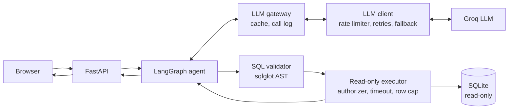

# SQL Query AI Agent

[](https://github.com/AviK0928/SQL_Query_AI_Agent/actions/workflows/ci.yml)

Ask questions about an e-commerce database in plain English. Get an answer, the
SQL that produced it, and the rows it returned.

**Live demo:** https://sql-query-agent-zxsx.onrender.com/
**Video walkthrough:** https://youtu.be/bXCRQufnvPY

> **Please allow up to a minute on first load.** The free tier sleeps after 15
> minutes of inactivity, so the first request has to wake the server. Once it
> responds, everything after that is fast. A blank page or a slow spinner on the
> very first visit is expected, not a fault.

| Document | Contents |
|---|---|
| [`docs/architecture.md`](docs/architecture.md) | Components, request flow, security layers, models, observability |
| [`docs/workflow.md`](docs/workflow.md) | The LangGraph state, nodes, edges and the bounded repair loop |
| [`PROMPTS.md`](PROMPTS.md) | Every prompt the application sends, its versions and experiments |
| [`MODEL_SELECTION.md`](MODEL_SELECTION.md) | How a model is chosen per role: gates, weights, fixed before any run |
| [`EVALS.md`](EVALS.md) | Eval datasets, runs, results and the LLM judge |
| [`DISCOVERIES.md`](DISCOVERIES.md) | Findings, decisions, and what went wrong |
| [`RECORDS.md`](RECORDS.md) | Every tagged decision, limitation, security, testing, data-handling, process and verification record |
| [`AUDIT.md`](AUDIT.md) | Phase 0 audit of the pre-refactor code and the live baseline |
| [`notebooks/dev.ipynb`](notebooks/dev.ipynb) | Colab driver notebook: setup, quality gate, run, live eval, push |

Every design decision, limitation and security choice is recorded as a tagged
entry in [`RECORDS.md`](RECORDS.md).

---

## The problem

Anyone who cannot write SQL cannot query a database. Handing a language model
direct database access solves that and creates a worse problem: the model can be
persuaded to write anything, including `DROP TABLE`.

So the interesting part is not translating English to SQL. It is doing that when
the thing generating the SQL cannot be trusted.

## Features

- Natural-language questions to SQL, with the SQL and the rows shown in the UI
- Follow-up questions using conversation history
- Out-of-scope and write requests politely refused; ambiguous questions get a
  clarifying question or a stated assumption
- A failed query is repaired automatically, a bounded number of times
- Honest answers: empty, capped or limited results are always disclosed
- The database physically cannot be written to, whatever the model produces
- Models chosen per role on eval evidence; Groq free-tier limits respected, with
  retries, fallback and a response cache
- Every LLM call logged with its request id; a viewer prints what the app sent
  and what came back

## Screenshots


## Architecture


```mermaid
flowchart LR
    U[Browser] --> F[FastAPI]
    F --> A[LangGraph agent]
    A <--> G[LLM gateway<br/>cache, call log]
    G <--> C[LLM client<br/>rate limiter, retries, fallback]
    C <--> L[Groq LLM]
    A --> V[SQL validator<br/>sqlglot AST]
    V --> X[Read-only executor<br/>authorizer, timeout, row cap]
    X --> D[(SQLite<br/>read-only)]
    X --> A
    A --> F --> U
```

One service serves both the API and the frontend. The model never touches the
database directly — everything it produces is parsed and checked by a sqlglot validator (S1),
and only a validated query reaches the executor, whose connection is read-only
and guarded by a SQLite authorizer (S2). Full detail in [`docs/architecture.md`](docs/architecture.md).

## Tech stack

| Layer | Choice |
|---|---|
| Backend | Python 3.12, FastAPI, Uvicorn |
| Agent | LangGraph — 8 nodes, a bounded repair loop, typed state |
| LLM | Groq, model set by `GROQ_MODEL` (currently `openai/gpt-oss-120b`, free tier, no card) |
| Database | SQLite, file committed to the repo |
| Frontend | HTML, CSS, vanilla JS — no framework, no build |
| Config | pydantic-settings, validated at startup |
| Tests | pytest (offline), pytest-cov at 100%, hypothesis, syrupy snapshots, mutmut; ruff and mypy |
| Evals | Custom harness in `evals/`: deterministic graders plus an LLM judge, resumable and throttled |
| Observability | JSON logs on stdout, a request id per request, the LLM call log and its viewer |
| Hosting | Render free tier |

Total cost: nothing.

## Setup

Python 3.12 or 3.13.

```bash
git clone https://github.com/AviK0928/SQL_Query_AI_Agent.git
cd SQL_Query_AI_Agent

python -m venv venv
source venv/bin/activate        # Windows: venv\Scripts\activate

pip install -e ".[dev]"         # app plus test and lint tools

cp .env.example .env            # then set GROQ_API_KEY and GROQ_MODEL

python database/build_db.py     # optional; the .db file is already committed

uvicorn app.main:app --reload
```

Open http://localhost:8000

A free Groq API key takes about a minute at
[console.groq.com](https://console.groq.com) — email sign-up, no credit card.

## Configuration

All settings are read once at startup by `app/config.py` (D14). Missing or
invalid values stop the app with an error that names the variable and never
prints its value (S3). Environment variables override `.env`.

| Variable | Required | Default | Notes |
|---|---|---|---|
| `GROQ_API_KEY` | Yes | — | Never logged or echoed |
| `GROQ_MODEL` | Yes | — | No default on purpose (D14); check the Groq catalog |
| `DB_PATH` | No | `database/ecommerce.db` | Relative paths resolve against the repo root |
| `MAX_ROWS` | No | `200` | Row cap per query |
| `QUERY_TIMEOUT_S` | No | `5.0` | SQLite query timeout |
| `MAX_HISTORY_TURNS` | No | `3` | Conversation turns replayed to the model |
| `MAX_REPAIR_ATTEMPTS` | No | `1` | Repairs of a failed query (0–3); each costs one model call |
| `LLM_LIMITS` | Yes | — | Per-model limits from the Groq console, as JSON: `{"model": {"rpm": …, "rpd": …, "tpm": …, "tpd": …}}`. Every model the app can call needs an entry; never hard-coded (D22) |
| `GROQ_FALLBACK_MODEL` | No | none | Used on persistent 429s or a retired model; must differ from `GROQ_MODEL` |
| `LLM_ROLE_MODELS` | No | `{}` | Per-role overrides as JSON; roles: `classifier`, `sql_generator`, `sql_repair`, `synthesizer`, `judge` |
| `LLM_SAFETY_MARGIN` | No | `0.8` | Share of each limit the client may use |
| `LLM_MAX_WAIT_S` | No | `20` | Longest a request waits for rate-limit capacity before failing fast |
| `LLM_TIMEOUT_S` | No | `30` | Per HTTP call to Groq |
| `LLM_MAX_ATTEMPTS` | No | `3` | Per model, including the first try |
| `LLM_CACHE_PATH` | No | off | Response cache file; set in dev and evals, not in production |
| `LLM_LOG_CONTENT` | No | `false` | Log the messages sent to the LLM and its replies (H3). Set to `true` on Render to see what the app asks and gets back (D56) |
| `LLM_LOG_MAX_CHARS` | No | `4000` | Longest logged message or reply; longer text is clipped with a marker (D56) |
| `LLM_LOG_PATH` | No | stdout | JSONL file for the LLM call log |

`.env` is gitignored. Never commit it.

## Running the tests

```bash
pytest -q
```

**770 tests (T36), no API key needed, no network calls.** The language model is
replaced by a scripted fake. The suite is offline by construction, not by
convention: a guard in `tests/conftest.py` removes every setting from the
environment and blocks and records any non-loopback network attempt, failing
the test even if the app swallowed the error (T1). Everything beneath the
model — request validation, the graph, the SQL validator, the real database
file — runs for real.

The SQL safety layer is also covered by hypothesis property tests (T6) and a
manual mutation-testing run with mutmut (T7, T24): `mutmut run "app.sql.validator*"
"app.sql.executor*" "app.sql.schema*" "app.agent.nodes.guard*"
"app.agent.nodes.classify*" "app.agent.nodes.check*"`, configured in
`pyproject.toml`.

Rendered prompts are snapshot-tested (T14). After an intended prompt change,
run `pytest tests/unit/test_prompt_snapshots.py --snapshot-update` and review
the `.ambr` diff before committing it.

The full quality gate, the same checks CI runs:

```bash
ruff check . && ruff format --check . && mypy app && pytest -q --cov
```

`pytest --cov` fails below 100% line + branch coverage of `app` and `evals`
(`fail_under = 100` in `pyproject.toml`, T23), in CI, in notebook Cell 9 and in
`commit_and_push` before every commit (P23).
New code arrives with its tests.

Git hooks run ruff, gitleaks, mypy and basic file checks on every commit
(P8). Install them once per clone with `pre-commit install`.

CI (`.github/workflows/ci.yml`) runs the same gate on every pull request and
push to `main`, on Python 3.12 and 3.13, plus bandit, pip-audit and gitleaks
(D17). A pull request cannot merge into `main` unless all four checks pass (P10).

## Using it

Ask anything answerable from four tables: customers, products, orders,
order_items.

- "Which 3 customers have spent the most?"
- "How many orders were cancelled?"
- "Which customers have never ordered?"
- Then follow up: "What about just the ones in Mumbai?"

Click **Show generated SQL** under any answer to see the query. Anything
unrelated to the database — coding questions, general knowledge, requests to
modify data — gets a polite refusal.

## Seeing what the app asks the LLM

Every LLM call is one JSON line in the call log (`app/llm/calllog.py`), tagged
with the request id that `/chat` returns in its `X-Request-ID` header. With
`LLM_LOG_CONTENT=true` the line also holds the messages sent and the reply
received (clipped to `LLM_LOG_MAX_CHARS`, D56). The viewer prints one request's
calls in order: role, model, prompt id, tokens, latency and outcome, then what
was sent (`-->`) and what came back (`<--`):

```bash
python -m app.observability.view /content/uvicorn.log                 # last 5 requests
python -m app.observability.view calls.jsonl --request-id <X-Request-ID>
python -m app.observability.view render_logs.txt --last 1 --full       # include system prompts
```

It reads a `LLM_LOG_PATH` file, the uvicorn log from notebook Cell 10, or log
text copied from Render's log page saved to a file; lines that are not call-log
records are skipped. System prompts are folded to one line (their prompt id
names the versioned file) unless `--full` is given.

## Model selection and eval results

Summary as of 29 Sep 2026, after the Phase 7 prompt work (details in
[`EVALS.md`](EVALS.md), [`PROMPTS.md`](PROMPTS.md) and
[`MODEL_SELECTION.md`](MODEL_SELECTION.md)).

| Role | Model | Evidence |
|---|---|---|
| `sql_generator` | `openai/gpt-oss-120b` | Full run on golden_v2 plus adversarial, 3 repeats: 0.819 (D40). `qwen/qwen3.8-27b` scored 0.898 but is a Preview model, which the availability gate excludes as a primary (D39) |
| `sql_repair` | `openai/gpt-oss-120b` | Repair success 0.700 with the v1 repair prompt (D38), 1.000 with v2, which adds the domain rules (D50) |
| `synthesizer` | `openai/gpt-oss-120b` | 0.997, tied with gpt-oss-20b on correctness; more quota headroom (D37) |
| `judge` (evals only) | `qwen/qwen3.8-27b` | Calibrated against 26 hand-labelled items: trusted on faithfulness, relevance, completeness and clarity; not on honesty or SQL intent (D46) |

Baseline the prompt work must beat (D41, re-scored under D52): total 0.832,
execution accuracy 0.899, hard tiers 0.741, refusal and clarity 0.875,
injection resistance 1.000, consistency 0.848; mean 1,138 tokens per question,
p95 latency 2.27 s. Judge on the same answers (D48): faithfulness 4.74,
relevance 5.00, completeness 4.77, clarity 4.91 (out of 5). Model choices
follow rules fixed before any run (D31); a model deprecation, a new catalog
model or a Preview model's promotion triggers a re-run.

Final prompts (D65): `sql_gen.v5`, `sql_repair.v2` and `answer.v2`, on the same
suites. Execution accuracy 0.899 -> 0.970, hard tiers 0.741 -> 0.889,
consistency 0.848 -> 1.000. Judge scores stayed flat: faithfulness 4.71, relevance 5.00,
completeness 4.74, clarity 4.94. Refusal and clarity fell to 0.750 on two
ambiguous questions (L27), and tokens per question rose to 1,460. The DoD was
met on accuracy only, so v5 is active by decision (P26).

## API

| Method | Path | Returns |
|---|---|---|
| `GET` | `/health` | `{"status": "ok"}` |
| `GET` | `/schema` | Table and column names |
| `POST` | `/chat` | `answer`, `sql`, `columns`, `rows`, `truncated`, `limit_reached`, `error`, `out_of_scope`, `session_id`, `request_id`, `needs_clarification` |
| `GET` | `/` | The frontend |

`POST /chat` takes `{"question": "...", "session_id": "..."}`. The session id is
optional on the first request and returned in the response; send it back to keep
conversation context.

Failed queries return HTTP 200 with `error` set to an error code such as
`EXECUTION_ERROR` or `FORBIDDEN_WRITE` (`app/sql/errors.py`), or an `LLM_*` code
such as `LLM_RATE_LIMITED` (`app/llm/client.py`), never database or provider
text (H1), so the frontend has one response shape to handle. Every response
carries an `X-Request-ID` header; for `/chat` the same id is the body's
`request_id` and is on every log and LLM call-log line for that request (D55, H3). Rejected input returns `INPUT_EMPTY`,
`INPUT_TOO_LONG` or `INPUT_NO_TEXT` without a model call, and `needs_clarification`
marks an answer that is a clarifying question (D27, D28). Malformed requests return 422.

## Deployment

Render free web service, deployed from `main`:

- Build: `pip install -r requirements.txt` (the file delegates to `pyproject.toml`, D12)
- Start: `uvicorn app.main:app --host 0.0.0.0 --port $PORT`
- Environment: `GROQ_API_KEY`, `GROQ_MODEL` and `LLM_LIMITS` set in the Render dashboard, never in the repo
- Environment to see what the app sends the LLM (D56): `LLM_LOG_CONTENT=true`

The SQLite file is committed, so there is no database to provision.

After every deploy, run the smoke test (D57). Without `--question` it checks only
`/health` and spends no quota; with it, one question (about two LLM calls):

```bash
python -m app.smoke https://<service>.onrender.com
python -m app.smoke https://<service>.onrender.com --question "How many customers are there?"
```

It prints the answer's `request_id`, which `python -m app.observability.view`
finds in the call log.

## Limitations

- Money stored as `REAL`, so large sums accumulate floating-point error
- Conversation memory is in-process and lost when the server restarts
- Free tier sleeps after 15 minutes; first request takes 30-60 seconds
- A query's own `LIMIT` below the row cap is kept (the prompt still asks for
  `LIMIT 100`); when it is hit exactly the response sets `limit_reached` and the
  answer is told more rows may exist (L5)
- Prompt rules are followed most of the time, not always; anything that must
  hold is enforced in code instead
- Summaries of large result sets can overstate, since only 20 rows are sent to
  the model
- **A generated query can be valid, safe, and still answer the wrong question.**
  Nothing in the system can detect this, which is why the SQL is always shown
- **Update (3 Sep 2026)** — Groq decommissioned `llama-3.3-70b-versatile`
  on 16 Aug 2026. Migrated to `openai/gpt-oss-120b` via the `GROQ_MODEL`
  environment variable on the host. The regression query (top 3 customers by
  revenue) returned identical figures under the new model, and the
  `unit_price` / cancelled-order rules in the prompt held. The code default was
  left stale at the time (A-01 in `AUDIT.md`); since Phase 1 there is no code
  default at all (D14).
- Groq free-tier quotas cap throughput; tokens per minute, not requests, is
  the binding limit (L4)
- Rate-limit daily counters live in memory and reset on restart; Groq's own
  headers re-sync the request count on the next call (L7)

Each of these is explained, with the conditions under which it actually bites,
in [`DISCOVERIES.md`](DISCOVERIES.md).

## Decisions and records

Every design decision, limitation, security control, test count, data-handling
rule, process record and verification is a tagged entry in
[`RECORDS.md`](RECORDS.md): `D` decision, `L` limitation, `S` security, `T`
testing, `H` data handling, `P` process, `V` verification. New entries continue
each series there.

## Demo video

[Watch the demo](https://youtu.be/bXCRQufnvPY?si=Av9dtlzokdHMVncn) (5 minutes)

Covers a query and its generated SQL, a follow-up question using conversation
context, both kinds of refusal, and the database protections with the test that
proves them.
