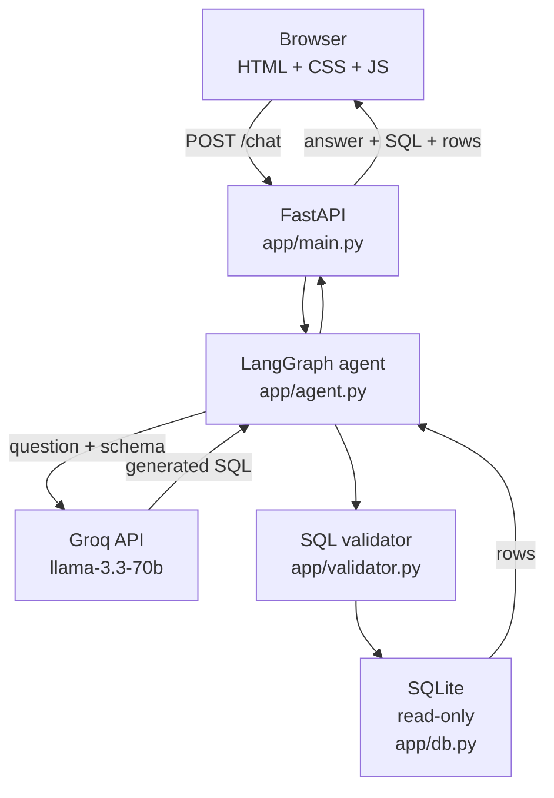
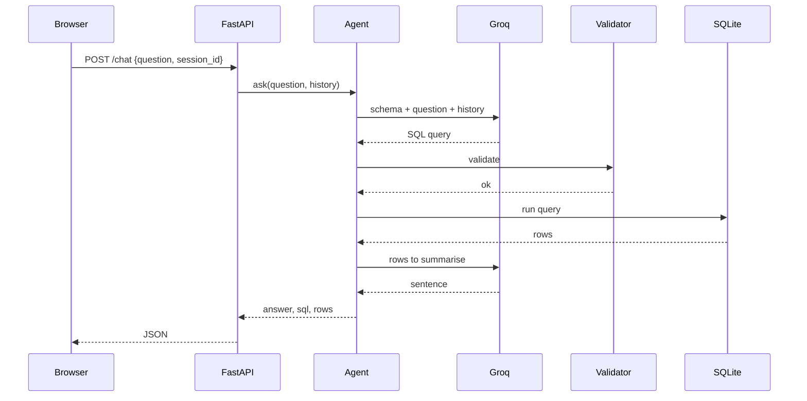

# Architecture

## Overview

One service. FastAPI serves both the API and the static frontend, so there is
no separate frontend deployment and no CORS configuration.

## Components

| File | Responsibility |
|---|---|
| `frontend/` | Chat UI. Plain HTML, CSS and JavaScript — no framework, no build step. |
| `app/main.py` | Three endpoints, request validation, session storage. |
| `app/agent.py` | The LangGraph flow. Calls the model, the validator and the database. |
| `app/prompts.py` | Every string sent to the model. |
| `app/validator.py` | Checks generated SQL before it runs. |
| `app/db.py` | Read-only database access. |
| `database/` | Schema, seed data, and the SQLite file (committed to the repo). |

## Request flow

If validation or the query fails, the agent sends the error back to the model
once and repeats from the validation step. Details in
[`workflow.md`](workflow.md).

## Security layers

The model's output is treated as untrusted. Four checks sit between it and the
database, and only the first can be talked out of doing its job:

| Layer | What it stops | Where |
|---|---|---|
| Prompt instruction | Most bad requests. **Not a guarantee.** | `app/prompts.py` |
| Validator | Non-SELECT statements, multiple statements | `app/validator.py` |
| sqlite3 driver | Multiple statements (runs one per call) | Python standard library |
| Read-only connection + authorizer | Every write, plus ATTACH and PRAGMA | `app/db.py` |

The authorizer is a callback SQLite runs while compiling each statement. It
returns "deny" for anything that is not a read, so a `DROP TABLE` fails inside
the database engine rather than in our Python code.

## Endpoints

| Method | Path | Returns |
|---|---|---|
| GET | `/health` | `{"status": "ok"}` — touches neither the database nor the model |
| GET | `/schema` | Table and column names |
| POST | `/chat` | `answer`, `sql`, `columns`, `rows`, `error`, `session_id` |
| GET | `/` | The frontend |

Failed queries return HTTP 200 with the `error` field filled in, so the frontend
has one response shape to handle. Malformed requests still return 422.

## What leaves the machine

Sent to Groq: the schema, the user's question, the last 3 question/SQL pairs,
and — only when a query succeeds — up to 20 result rows.

Never sent: the database file, the API key is used for auth only, and any row
the query did not return.

## Deployment

Render free tier, one instance. Build: `pip install -r requirements.txt`.
Start: `uvicorn app.main:app --host 0.0.0.0 --port $PORT`. The SQLite file is
committed, so there is no database to provision. `GROQ_API_KEY` is set in the
Render dashboard, never in the repository.

The instance sleeps after 15 minutes idle; the next request takes 30-60 seconds.
