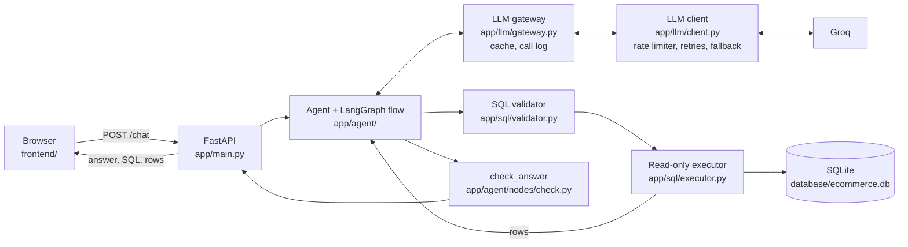
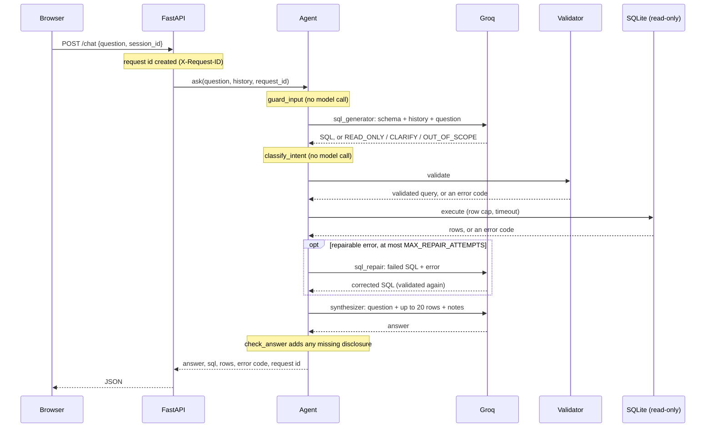

# Architecture

## Overview

```mermaid
flowchart LR
    U[Browser<br/>frontend/] -->|POST /chat| F[FastAPI<br/>app/main.py]
    F --> A[Agent + LangGraph flow<br/>app/agent/]
    A <--> G[LLM gateway<br/>app/llm/gateway.py<br/>cache, call log]
    G <--> C[LLM client<br/>app/llm/client.py<br/>rate limiter, retries, fallback]
    C <--> L[Groq]
    A --> V[SQL validator<br/>app/sql/validator.py]
    V --> X[Read-only executor<br/>app/sql/executor.py]
    X --> D[(SQLite<br/>database/ecommerce.db)]
    X -->|rows| A
    A --> K[check_answer<br/>app/agent/nodes/check.py]
    K --> F -->|answer, SQL, rows| U
```

One service. FastAPI serves the API and the static frontend, so there is one
deployment and no cross-origin traffic. The model's output is treated as
untrusted: it only ever becomes a query after the validator has parsed and
checked it, and the executor's connection cannot write whatever reaches it.

## Components

| Path | Responsibility |
|---|---|
| `frontend/` | Chat UI: plain HTML, CSS and JavaScript, no framework or build step. Model output is inserted with `textContent`, never `innerHTML`. |
| `app/config.py` | Typed settings (pydantic-settings), validated once at startup; the app refuses to start on a missing or invalid value (D14). |
| `app/main.py` | `create_app()`: wires settings, logging, the agent and the session store; routes `/health`, `/schema`, `/chat`, `/`. |
| `app/agent/graph.py` | `Agent`: owns the LangGraph flow and its injected dependencies (LLM gateway, database, executor). |
| `app/agent/nodes/` | Pure node logic with no model call: `guard.py` (input checks), `classify.py` (what the generator's reply is), `check.py` (honest disclosure). |
| `app/agent/state.py`, `replies.py`, `llm.py` | The typed state, the fixed replies, and the production LLM stack builder. |
| `app/prompts/` | Versioned prompt files (`sql_gen.v1.md`, `sql_repair.v2.md`, `answer.v1.md`, ...), the loader, and `ACTIVE_VERSIONS`. A released file is never edited (D42). |
| `app/llm/` | `client.py` (Groq transport, retries, `retry-after`, fallback), `limiter.py` (per-model token buckets from `LLM_LIMITS`), `cache.py` (response cache), `calllog.py` (one JSON line per call), `registry.py` (role → model), `budget.py` (token accounting), `gateway.py` (all of it behind one `complete()`). |
| `app/sql/` | `validator.py` (sqlglot AST checks and the row-cap rewrite), `executor.py` (read-only connection, authorizer, timeout), `schema.py` (compact schema and its hash), `errors.py` (the error-code taxonomy). |
| `app/db.py` | `Database`: schema introspection for the prompt and `/schema`, and the schema hash. |
| `app/observability/` | `logs.py` (JSON log lines on stdout), `middleware.py` (request id per request, access record), `view.py` (prints what the app sent the LLM and what came back). |
| `app/smoke.py` | Post-deploy smoke test. |
| `evals/` | Eval harness: datasets, graders, the resumable runner, the LLM judge and dated reports (EVALS.md). |
| `database/` | Schema, seed data and the SQLite file (committed). |

## Request flow

```mermaid
sequenceDiagram
    participant U as Browser
    participant F as FastAPI
    participant A as Agent
    participant L as Groq
    participant V as Validator
    participant D as SQLite (read-only)

    U->>F: POST /chat {question, session_id}
    Note over F: request id created (X-Request-ID)
    F->>A: ask(question, history, request_id)
    Note over A: guard_input (no model call)
    A->>L: sql_generator: schema + history + question
    L-->>A: SQL, or READ_ONLY / CLARIFY / OUT_OF_SCOPE
    Note over A: classify_intent (no model call)
    A->>V: validate
    V-->>A: validated query, or an error code
    A->>D: execute (row cap, timeout)
    D-->>A: rows, or an error code
    opt repairable error, at most MAX_REPAIR_ATTEMPTS
        A->>L: sql_repair: failed SQL + error
        L-->>A: corrected SQL (validated again)
    end
    A->>L: synthesizer: question + up to 20 rows + notes
    L-->>A: answer
    Note over A: check_answer adds any missing disclosure
    A-->>F: answer, sql, rows, error code, request id
    F-->>U: JSON
```

A rejected question stops at `guard_input` without a model call; a refusal or a
clarifying question stops at `classify_intent`. The graph, its state and its
bounded repair loop are described in [`workflow.md`](workflow.md).

## Security layers

The model's output is untrusted. Only the first layer depends on the model
cooperating:

| Layer | What it stops | Where |
|---|---|---|
| Prompt rules | Most bad requests. **Not a guarantee.** | `app/prompts/` |
| Input guard | Empty, oversized or non-text questions, before any model call | `app/agent/nodes/guard.py`, `app/main.py` |
| Validator (sqlglot AST) | Anything but one `SELECT` (CTEs allowed): writes, DDL, `PRAGMA`, `ATTACH`, stacked statements, tables outside the allowlist, forbidden functions; rewrites `LIMIT` to the row cap | `app/sql/validator.py` (S1) |
| Read-only executor | Every write, even from SQL that passed validation: `mode=ro` connection plus a SQLite authorizer that denies anything but reads; a timeout and the row cap | `app/sql/executor.py` (S2) |
| `check_answer` | An answer that hides a capped, limited or empty result | `app/agent/nodes/check.py` (D29) |

The authorizer is a callback SQLite runs while compiling each statement, so a
`DROP TABLE` fails inside the database engine, not in Python code.

## Models

Each model call has a role (`sql_generator`, `sql_repair`, `synthesizer`), and
each role can have its own model (`LLM_ROLE_MODELS`); all three use
`openai/gpt-oss-120b`, chosen on eval evidence (MODEL_SELECTION.md, D37, D38,
D40). The client keeps under the configured Groq limits, honours `retry-after`,
retries with backoff, and falls back to `GROQ_FALLBACK_MODEL` on persistent
429s or a retired model (D23). Temperature is 0.

## Endpoints

| Method | Path | Returns |
|---|---|---|
| GET | `/health` | `{"status": "ok"}`; touches neither the database nor the model |
| GET | `/schema` | Table and column names |
| POST | `/chat` | `answer`, `sql`, `columns`, `rows`, `truncated`, `limit_reached`, `error`, `out_of_scope`, `session_id`, `request_id`, `needs_clarification` |
| GET | `/` | The frontend |

Failed queries return HTTP 200 with `error` set to a code, never database or
provider text (H1), so the frontend has one response shape. Malformed requests
return 422.

## Observability

Every request gets a `request_id` (uuid4) at HTTP entry, in
`app/observability/middleware.py`. It is returned in the `X-Request-ID` header
and, for `/chat`, in the body, and it is carried by every log line and every LLM
call-log line for that request, so one question can be followed from HTTP entry
to answer by filtering the logs on it (D55).

Logs are JSON lines on stdout, one object per record
(`app/observability/logs.py`). They record what happened and how long it took,
never question text, SQL, rows or exception messages (H5).

What the app asks the LLM and what it gets back is in the LLM call log
(`app/llm/calllog.py`): one line per call with the same `request_id`, and with
`LLM_LOG_CONTENT=true` the messages and the reply, each clipped to
`LLM_LOG_MAX_CHARS` (D56). `python -m app.observability.view` prints one
request's calls in order (README, "Seeing what the app asks the LLM"). There is
no separate tracing or metrics system.

## What leaves the machine

Sent to Groq: the system prompt (rules and the compact schema), the user's
question, the last 3 question/SQL pairs of the session, on a repair the failed
SQL and its error message, and for the answer up to 20 result rows with notes on
truncation or limits.

Never sent: the database file, rows the query did not return, the API key
(used for authentication only).

## Deployment

Render free tier, one instance, deployed from `main`. Build:
`pip install -r requirements.txt` (which delegates to `pyproject.toml`). Start:
`uvicorn app.main:app --host 0.0.0.0 --port $PORT`. The SQLite file is
committed, so there is no database to provision. Secrets and limits
(`GROQ_API_KEY`, `GROQ_MODEL`, `LLM_LIMITS`) are set in the Render dashboard,
never in the repository.

The instance sleeps after 15 minutes idle; the next request takes 30-60 seconds.

After a deploy, `python -m app.smoke <url>` checks `/health`; with `--question`
it also asks one real question and checks its answer and request id (D57).
