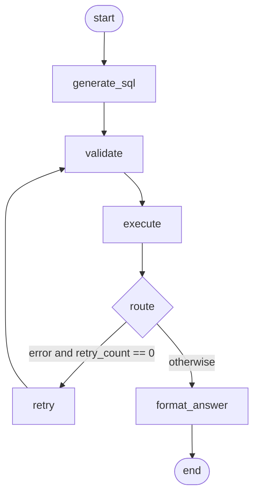

# LangGraph workflow

## What LangGraph is doing here

LangGraph structures the agent as a small state machine. Instead of one function
with nested `if` statements, each step is a node, and the connections between
them are edges.

For a flow this small a plain function would also work. The graph earns its
place for one reason: the retry limit becomes a property of the wiring rather
than a counter someone could later change by mistake.

| Term | Meaning here |
|---|---|
| State | A dictionary carrying the question, SQL, rows and errors between steps |
| Node | A function that reads the state and returns the fields it changed |
| Edge | Which node runs next |
| Conditional edge | A function that reads the state and picks the next node |

Nodes do not modify the state directly. They return a partial dictionary and
LangGraph merges it in.

## Entry point

`app/agent.py` exposes one function:

```python
ask(question, history=None) -> dict
```

`app/main.py` calls it and returns the result as JSON. Nothing else in the
project imports the graph.

## State

```python
class AgentState(TypedDict, total=False):
    question: str        # from the user
    history: list        # last 3 question/SQL pairs
    sql: str | None      # generated query
    columns: list        # result column names
    rows: list           # result rows
    truncated: bool      # more rows existed than were returned
    error: str | None    # validation or database error
    retry_count: int     # 0 or 1
    out_of_scope: bool   # question was not about the database
    answer: str          # final sentence shown to the user
```

## The graph



## Nodes

**`generate_sql`** — one model call. Sends the schema, the question and any
history. If the reply contains `OUT_OF_SCOPE`, it sets that flag and a fixed
answer; the later nodes then skip their work.

**`validate`** — no model, no database. Calls `validate_sql()`, which checks the
statement starts with SELECT or WITH, contains no forbidden keyword, and is a
single statement. Strips comments first so keywords cannot hide behind them. On
failure it writes a message into `error`.

**`execute`** — runs the query through `app/db.py`. Returns early if the question
was out of scope or validation already failed. `run_query` never raises; SQL
errors come back in the `error` field so the retry step can use them.

**`retry`** — one model call, at most once. Sends the failed SQL and the exact
error back to the model and asks for a correction. Sets `retry_count = 1`.

**`format_answer`** — one model call. Turns the rows into a sentence. Skipped for
out-of-scope questions and for errors, which both have fixed replies.

## The one branch

```python
def route_after_execute(state):
    if state.get("error") and state.get("retry_count", 0) == 0:
        return "retry"
    return "answer"
```

This is the only decision in the graph.

**Why an infinite loop is impossible:** the retry node sets `retry_count = 1`.
When the retried query fails, the router sees `retry_count == 1` and sends the
flow to `format_answer`, which ends. There is no path back to `retry` a second
time. This is enforced by the graph's shape, not by a guard that could be
removed.

**Why retry goes back to `validate`, not `execute`:** SQL from the retry call is
exactly as untrusted as SQL from the first call, so it passes through the same
check.

## Error handling

| Failure | What happens |
|---|---|
| Model returns non-SELECT SQL | Validator rejects it, one retry with the reason |
| Model invents a column | SQLite rejects it, one retry with SQLite's message |
| Retry also fails | Fixed error message, no third model call |
| Question is out of scope | Fixed reply, database never touched |
| Groq is down or rate-limited | Caught in `main.py`, generic message returned, real error logged server-side only |

## Guardrails

| Where | What |
|---|---|
| `main.py` | Question must be 1-500 characters (rejected with 422 before the agent runs) |
| `prompts.py` | Scope and injection instructions — reduce bad requests, do not prevent them |
| `validator.py` | SELECT only, single statement, no forbidden keywords |
| `db.py` | Read-only connection, SQLite authorizer, 200-row cap, 5-second timeout |
| `frontend/app.js` | Model output inserted with `textContent`, never `innerHTML` |

Only the `prompts.py` row depends on the model cooperating. The others hold
regardless of what the model returns.

## Conversation memory

History lives on the server in a dictionary keyed by `session_id`. The browser
sends only a question and a session id — never prior turns.

Only successful queries are stored. Replaying failed SQL would feed the model
its own mistakes. The last 3 pairs are replayed as alternating user/assistant
messages, which is what lets "and what about Pune?" work.

Memory is lost when the server restarts. That is acceptable here and documented
as a limitation.
