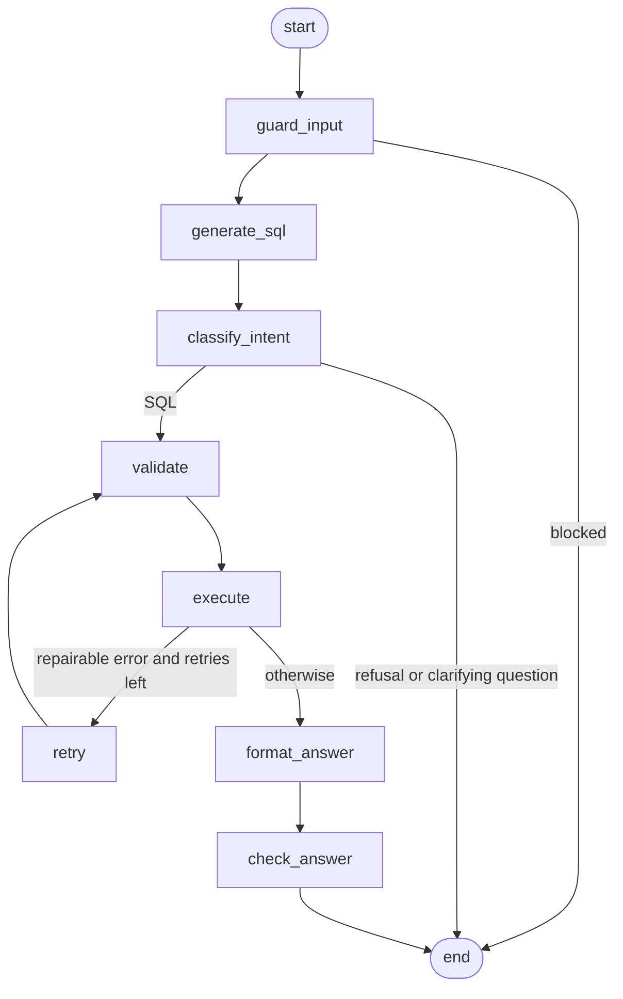

# LangGraph workflow

## What LangGraph is doing here

The agent is a small state machine: each step is a node, and edges decide which
node runs next. Nodes do not modify the state; they return the fields they
changed and LangGraph merges them in.

A plain function could run this flow. The graph earns its place because the
repair loop is bounded by its wiring and the state's counter, not by a check
someone could later remove, and because every node can be tested on its own.

| Term | Meaning here |
|---|---|
| State | A typed dictionary (`app/agent/state.py`) carrying the question, SQL, rows, error code and answer between steps |
| Node | A method of `Agent` (`app/agent/graph.py`) that reads the state and returns the fields it changed |
| Edge | Which node runs next |
| Conditional edge | A function that reads the state and picks the next node |

## Entry point

```python
Agent(settings, llm=None).ask(question, history=None, request_id=None) -> dict
```

`app/main.py` builds one `Agent` at startup and calls `ask` for every `/chat`
request, passing the request id created at HTTP entry (D55). Evals and tests
build their own `Agent` with a scripted or real LLM gateway; nothing uses module
globals.

## State (main fields)

```python
class AgentState(TypedDict, total=False):
    question: str                  # from the user
    history: list                  # recent question/SQL turns of the session
    request_id: str                # shared by every LLM call for this question
    blocked: bool                  # guard_input rejected the question
    reply: str                     # the generator's raw reply
    sql: str | None                # latest SQL (raw until validated)
    validated: ValidatedQuery | None
    columns: list
    rows: list
    truncated: bool                # more rows existed than the row cap
    limit_reached: bool            # the query's own LIMIT was reached
    error: str | None              # an error code, never database text
    error_detail: str | None       # for the repair prompt only
    repairable: bool
    retry_count: int
    max_repairs: int               # MAX_REPAIR_ATTEMPTS (default 1, at most 3)
    out_of_scope: bool
    needs_clarification: bool
    answer: str
    answer_checks: list[str]       # check_answer findings
    usage: dict[str, int]          # tokens for this question
```

## The graph


```mermaid
flowchart TD
    S([start]) --> G[guard_input]
    G -->|blocked| X([end])
    G --> Q[generate_sql]
    Q --> C[classify_intent]
    C -->|refusal or clarifying question| X
    C -->|SQL| V[validate]
    V --> E[execute]
    E -->|repairable error and retries left| R[retry]
    E -->|otherwise| F[format_answer]
    R --> V
    F --> K[check_answer]
    K --> X
```

## Nodes

| Node | Model call | What it does |
|---|---|---|
| `guard_input` | none | Rejects empty, over-long (500 characters) or non-text questions with a fixed reply and `INPUT_*` code |
| `generate_sql` | `sql_generator` | Sends the system prompt with the schema, the session history and the question; returns SQL or a token (`READ_ONLY`, `CLARIFY`, `OUT_OF_SCOPE`) |
| `classify_intent` | none | Decides what the reply is: a write request (fixed read-only reply), out of scope (fixed reply), a clarifying question (returned as the answer), or SQL |
| `validate` | none | `validate_sql()`: sqlglot parse, single `SELECT`, allowlisted tables, no forbidden functions, `LIMIT` rewritten to the row cap. Failure sets an error code |
| `execute` | none | Runs the validated query through the read-only executor. Skipped if validation failed |
| `retry` | `sql_repair` | Sends the failed SQL and its error back and asks for a fix; increments `retry_count` |
| `format_answer` | `synthesizer` | Turns up to 20 rows into an answer, with notes when rows are hidden, capped or limited. Errors get a fixed reply per code instead |
| `check_answer` | none | Adds a missing disclosure (empty, capped or limited result) and records numbers the rows do not support (D29) |

## The repair loop

```python
def route_after_execute(state):
    if (
        state.get("error")
        and state.get("repairable")
        and state.get("retry_count", 0) < state.get("max_repairs", 1)
    ):
        return "retry"
    return "answer"
```

Only repairable codes earn a repair: `PARSE_ERROR`, `UNKNOWN_TABLE`,
`EXECUTION_ERROR` (for example an unknown column) and `INVALID_LIMIT`. A
forbidden write, a stacked statement or a timeout is final, because retrying it
spends a Groq request with no chance of a safe, useful result (D20).

**Why the loop always ends:** `retry` increments `retry_count`, and the router
stops once it reaches `max_repairs` (`MAX_REPAIR_ATTEMPTS`, validated to 0-3).

**Why retry goes back to `validate`, not `execute`:** repaired SQL is exactly as
untrusted as the first attempt, so it passes the same checks.

## Error handling

| Failure | What happens |
|---|---|
| The model writes a non-`SELECT` statement | The validator rejects it (`FORBIDDEN_WRITE` and similar); final, fixed reply |
| The model invents a column or table | A repairable code; one repair with the error, then validation again |
| The repair also fails | Fixed reply for the code; no further model call |
| Out-of-scope or write request | Fixed reply; the database is never touched |
| Groq busy, down or the model retired | The client retries, honours `retry-after`, falls back; if all fail, an `LLM_*` code and a fixed reply (D23) |
| Only the answer call fails | The rows are still returned, with a fixed note that the summary is unavailable |
| Anything unexpected | Caught in `app/main.py`: `internal_error`, logged with its type and stack only (H5) |

## Conversation memory

History lives on the server, keyed by `session_id`; the browser sends only a
question and the session id. Only successful queries and clarifying exchanges
are stored, so the model is never fed its own failed SQL. The last
`MAX_HISTORY_TURNS` (default 3) turns are replayed as user/assistant messages,
which is what lets "and what about Pune?" work. Memory is process-local and lost
on restart (L3).
